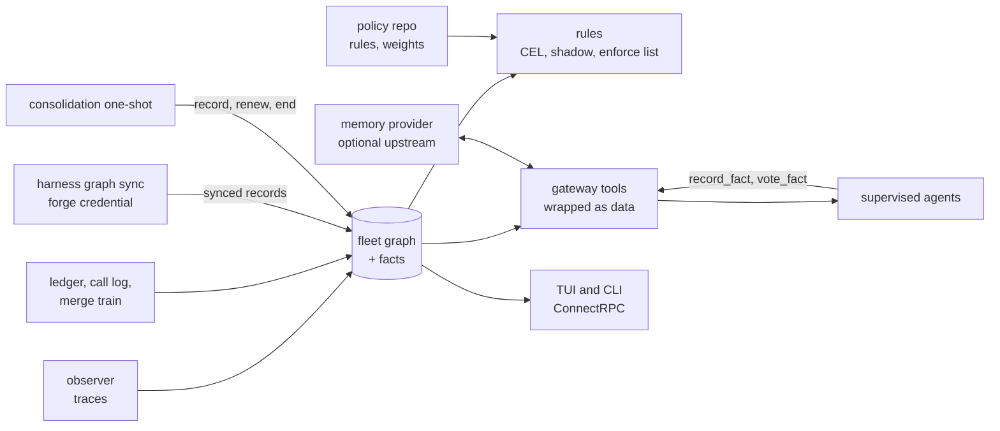
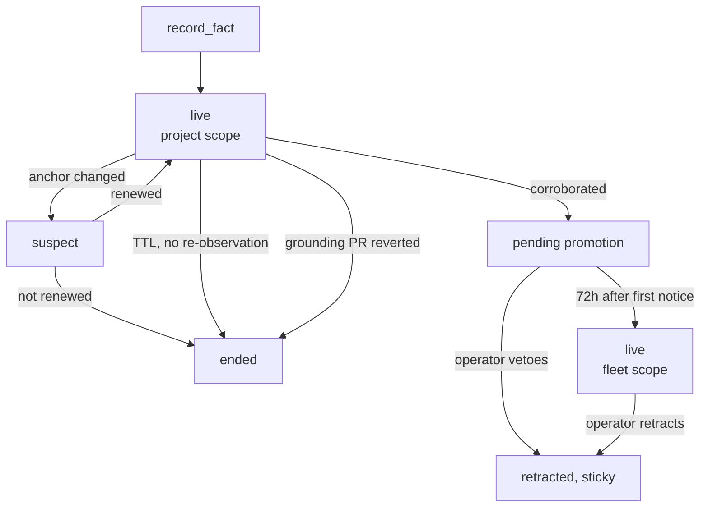

# ADR-0041: Fleet memory — a deterministic fleet graph, facts that expire when the code moves, and rules the operator reviews

> **Not yet implemented.** Design stage. The graph can be built on what exists
> today (the observer, the loop guard, the run ledger and the merge train); facts,
> rules and memory providers need ADR-0037's store and ADR-0035's gateway.

## Context and Problem Statement

Harness watches every agent it supervises, and remembers almost none of it in a
form anything can ask about. The observer delivers each trace event once and
keeps nothing. The ledger records runs, not what they touched. The merge train
knows which pull requests are queued; nothing joins that to the runs that wrote
them. Three consequences recur:

* **Two harnesses collide and find out at merge.** Nothing can answer "who else
  is editing this file right now", although every edit is in a trace the
  observer is already reading.
* **What one agent learns, the others relearn.** A fact such as "this repo's CI
  runner has slow fsync, so ledger-bound tests flake" or "PTY races only
  reproduce on Linux" lives in one agent's private memory, which is keyed to
  one adapter and often to one working directory. A crush or codex harness in
  the same repository never sees what a Claude Code session wrote down.
* **A stopped loop cannot explain itself.** The loop guard stops a runaway
  harness. Neither the operator nor the agent can then ask why, what it was
  doing, or whether the same thing happened last night.

Harness already has one path for shared knowledge: skills (ADR-0012, ADR-0030,
ADR-0036). A skill is a procedure, grounded in a merged pull request, verified
blind, and promoted when a human merges it. That is the right gate for
instructions every agent will follow. It is too slow and too heavy for facts,
which are descriptive, often local, and go stale in days.

Two kinds of prior art were reviewed. A neurosymbolic graph-RAG knowledge base
(entity graph with bitemporal edges, a symbolic rule engine, a periodic
"dream" cycle that re-extracts and prunes, and usage feedback that may only break
ranking ties) showed which mechanisms carry over and which do not: its
open-ended model extraction into a graph of hundreds of entity types does not.
Episodic memory products (mem0, Zep and Graphiti, Letta, basic-memory, and
others) showed that operators already have favorites and will want to keep
them.

**What should Harness remember about the fleet's work, who may write it, how does
it expire, how does it reach agents and the operator, and where does a human stay
in the loop, without adding a process Harness does not already supervise?**

## Decision Drivers

* **Deterministic where it can be.** Anything that can be derived from run
  records, the ledger or a forge by code is derived by code, reproducibly, with
  no model.
* **No required external process.** One binary and one store (ADR-0037). An
  operator may plug in a memory product; Harness never requires one.
* **Memory is data, never instruction.** ADR-0036 made utility-model output
  data; the same holds for everything memory serves. Memory can change what an
  agent concludes, never what it may do.
* **The human gates authority and reach, not every write.** A person decides
  what may act (rules that hold or stop harnesses), what the vocabulary and
  weights are, and what reaches the whole fleet. Reviewer time is the scarce
  resource (ADR-0030).
* **Code on the ground changes.** A fact about code must expire when that code
  changes, not on a timer, and must survive while the code sits still.
* **No self-reinforcement.** A run that was shown a fact cannot corroborate it,
  generalizing SPEC-0007's "Retrieval does not reinforce itself".
* **Agent-neutral.** Everything is built from agent-trace's normalized records
  (ADR-0033), so every supported adapter reads and writes the same memory.
* **Legible.** Every served fact traces back to the runs, votes and trace events
  behind it, in the TUI and over the API.
* **Context is scarce.** Agents pull memory through tools. Nothing is pushed
  into a harness's context unless the operator opts that harness in, and then
  only a capped briefing.

## Considered Options

### Decision 1 — Where fleet memory lives

* Option 1 — No fleet memory; each agent keeps its own (today).
* Option 2 — An external knowledge service: a graph-RAG server, or a graph
  database such as a property-graph engine over Bolt.
* Option 3 — Fleet memory in the daemon's store: a deterministic graph and a
  facts table, with episodic memory behind a pluggable provider.

### Decision 2 — How a fact is gated

* Option 1 — A human approves every fact.
* Option 2 — A judge model decides which facts are kept and shared.
* Option 3 — Tiered by kind and reach: deterministic kinds need no gate;
  agent-asserted facts are live in their project at once; reaching the whole
  fleet takes independent, weighted corroboration and survives a human veto
  window.

### Decision 3 — How a fact expires

* Option 1 — A wall-clock time-to-live on every fact.
* Option 2 — Facts never expire; people retract them.
* Option 3 — Facts anchor to what they describe. A change to an anchor makes the
  fact suspect; commits that touch it lower its confidence. Only unanchored
  facts expire on a timer, and re-observation renews them.

### Decision 4 — The rule language

* Option 1 — SQL queries over the store.
* Option 2 — Lean 4.
* Option 3 — A Datalog-style `when`/`then` rule format.
* Option 4 — CEL (`cel-go`) with a fixed set of windowed aggregation primitives.

### Decision 5 — Who writes rules

* Option 1 — The operator writes every rule.
* Option 2 — Models write rules and they take effect on their own.
* Option 3 — Models propose rules as pull requests carrying a backtest; a human
  merges; merged rules run in shadow first; only rules the operator lists by
  hand may hold or stop a harness.

### Decision 6 — Episodic memory

* Option 1 — Built in only.
* Option 2 — Require an external memory product.
* Option 3 — Pluggable through the gateway, with a built-in default; Harness
  shapes what goes in and wraps what comes out.

### Decision 7 — Where model work runs

* Option 1 — In the daemon, as utility calls.
* Option 2 — As client commands, like `harness distill`.
* Option 3 — As scheduled prompt one-shots whose only write path is a set of
  narrow memory tools.

## Decision Outcome

Chosen options: **Decision 1, Option 3**, **Decision 2, Option 3**,
**Decision 3, Option 3**, **Decision 4, Option 4**, **Decision 5, Option 3**,
**Decision 6, Option 3** and **Decision 7, Option 3**, with the one exception
under [Where model work runs](#where-model-work-runs).

In one sentence: the daemon keeps a graph of the fleet's own work that code
builds from records, plus a table of facts that agents may assert, that expire
when the code under them moves, that reach the whole fleet only through
independent corroboration and a veto window, and that are always served as
sourced hints; models propose rules and consolidate facts through supervised
one-shots, and the operator owns the vocabulary, the weights, the thresholds and
anything that can act.

### What Harness remembers

Harness manages agents **and what they collectively know about their own
work**: repositories, branches, pull requests, files, runs, sessions, skills, and
the infrastructure those runs touched. It does not ingest documents, feeds, web
pages or anything else that is not the fleet's own work. That line is what
keeps fleet memory agent management rather than a general knowledge base, and
every spec under this ADR holds it.

### The fleet graph

A graph of typed nodes and typed, timestamped edges, built by code and never by a
model (SPEC-0027).

Nodes are `harness`, `run`, `session`, `repo`, `branch`, `commit`,
`pull_request`, `file`, `skill`, `trigger`, `train`, `tool` and `dependency`.
A repository is keyed by its canonical forge host, owner and name, never a
mirror's. `tool` and `dependency` give facts a subject that several
repositories share, such as a linter or a module. Each edge kind has one
source:

| Edges | Source |
|---|---|
| `spawned` (harness → run), `triggered_by` (run → trigger) | the run ledger (ADR-0028) |
| `recorded` (run → session), `in_repo`, `on_branch` | the session's `SessionMeta` (agent-trace) |
| `read`, `edited`, `verified` (run → file), `ran` (run → tool) | the trace's classified actions |
| `loaded` (run → skill) | the gateway call log (ADR-0035) |
| `opened` (branch → pull_request), `merged_as`, `reverted_by`, `reviewed`, `depends_on` (repo → dependency) | `harness graph sync`, from the forge |
| `queued` (pull_request → train) | the merge train (ADR-0032), in process |

* **Live.** The observer already follows transcripts as they are written, so an
  `edited` edge appears seconds after the edit. A run's edits are its
  **presence** on a file until the run ends or goes quiet on that file for a
  configured window. Two live runs from different harnesses present on one file
  are a **collision**, shown on the live board, answered by `who_else_is_here`,
  and available to rules. Two live runs on one branch collide too, except on
  the default branch, where parked checkouts would make that noise.
* **A projection.** Everything but synced forge records is derived from stored
  run records and a small source journal of merge-train and loop-guard events,
  which today are only logged or held in memory. `harness graph rebuild`
  reproduces the same graph, and a test checks that two rebuilds produce the
  same digest.
* **Forge data comes from a client command.** `harness graph sync` reads pull
  requests, merges, reverts, reviews, dependency versions and the default
  branch's tree from each repository's forge, plus the per-anchor commit counts
  and changed line ranges that fact expiry needs, with a credential from each
  forge table's own `env_file` (ADR-0038). It pushes what it read to the daemon
  as `synced` records. The merge train already
  holds a write token for the repositories it merges; graph sync keeps the
  daemon from also needing read access to every repository in the fleet. It runs
  by hand or as a built-in scheduled job, the way ADR-0036's eval job does.

### Facts

One table, with a `kind` column (SPEC-0028):

| `kind` | Written by | Votes |
|---|---|---|
| `observed` | the daemon's observer, from a trace or the ledger | never |
| `synced` | `harness graph sync`, from a forge | never |
| `asserted` | an agent, through a memory tool; the tool handler sets the kind | yes |
| `operator` | the operator, through the TUI, CLI or API | never; authoritative |

Two SQLite triggers make the table enforce what matters: a vote on a fact whose
kind is not `asserted` aborts, and an update to `kind` aborts. Which caller may
write which kind is enforced in the handler, because the daemon is the only
writer the database sees. A separate `untrusted_source` flag records whether a
fact was derived from content Harness does not trust (issue and pull request
bodies, review text, web pages, tool output): an asserted fact summarized from
an issue is still `asserted`, and is also untrusted.

A fact has a subject (a graph node), a predicate from a closed vocabulary that
ships with the binary, a bounded value, a **scope** (`project:<repo>` or
`fleet`), a validity window, a status (`live`, `suspect`, `pending_promotion`,
`ended`, `retracted`) and its **anchors**. A retraction is sticky: the same
subject, predicate and value cannot be asserted back to live for a configured
period, as ADR-0030 remembers a rejected skill.

**Facts never ground skills.** ADR-0030's grounding evidence stays merged, green,
unreverted pull requests. A fact may be cited in a distillation dossier as
context; it never counts toward a candidate.

### Expiry follows the code

| Anchor | Recorded when written | The fact becomes suspect when |
|---|---|---|
| path and line span | blob SHA and span | the lines in the span change on the default branch |
| path | blob SHA | the file changes or is deleted |
| dependency | module and version | the version changes |
| tool or agent version | agent CLI version, runner image tag | the version changes |
| grounding pull request | number and merge SHA | the pull request is reverted: the fact **ends** |

* **Suspect is not ended.** A suspect fact is served at reduced weight and marked
  `suspect`, cannot be promoted, pauses any veto window it is in, and joins a
  bounded re-verification queue. The consolidation one-shot either renews it
  against the new blob SHA or ends it.
* **Churn, not time.** Each commit that touches an anchor lowers the fact's
  confidence. A file nobody has touched in a year keeps its facts at full
  strength.
* **Unanchored facts live on re-observation.** Each run that observes the same
  thing again renews one; with no re-observation it ends after a time-to-live.
* **Deterministic facts end on events.** Presence ends when a run ends. Decay
  applies to asserted facts only.

| Default | Value |
|---|---|
| Anchored fact | no time limit; suspect when an anchor changes |
| Unanchored fact, trusted source | 30 days since last re-observation |
| Unanchored fact, untrusted source | 7 days, and never promoted fleet-wide without the operator |
| Re-verification per consolidation run | 5 suspect facts, oldest first |
| Veto window | 72 hours from first notification |

Anchor changes come from `harness graph sync`, which already reads each default
branch: one tree listing per repository per sync, compared with stored blob SHAs.
SPEC-0007 accepted the same cost for skill staleness.

### Reaching the fleet: corroboration and a veto window

An asserted fact is live in its own project as soon as it is written. Reaching
`fleet` scope takes corroboration, and the design treats **independence as a
bigger problem than weighting**: five Claude runs agreeing are not five votes.

* **Distinct sources.** Promotion needs support from at least a minimum number
  of distinct repositories, distinct model families and distinct runs, whatever
  the weights say, so no single strong model promotes a fact alone.
* **Capped families.** Each model family's weighted support is capped.
* **No self-corroboration.** A run that was shown the fact (a `recall` result, a
  briefing, a graph query) before voting does not count. The call log records
  calls but not what they returned, so every memory tool records an exposure
  row for each fact it serves, and withholds a fact whose row fails to write.
* **Weights from pinned public data.** A snapshot of public model rankings (for
  example SWE-bench Verified and Aider's polyglot benchmark) is stored with its
  source and content hash; a model's starting weight is computed from that
  snapshot, and a model the snapshot does not list gets a low default.
* **Adjusted by local record.** Each family's weight is adjusted by a
  beta-binomial over its own history here: how many facts it supported were
  upheld and how many were retracted. The computation reads stored rows only,
  so it is deterministic and reproducible.
* **Weights are authority.** The snapshot and the family mapping live in a
  **policy repo** (below) and change only through a pull request the operator
  reviews. The thresholds live in hand-written global configuration
  (`[memory.promotion]`), so a weights pull request cannot also lower the bar.

A fact that meets the thresholds becomes `pending_promotion`. Its **veto window**
of 72 hours starts when the operator is first told: the fact appears in the TUI
feed, an API listing of pending facts returns it to an operator client, or the
`[notify]` hook delivers a `memory_digest` naming it. If none of those happens,
the clock never starts and the fact never promotes; silence promotes only after
the operator had a real chance to object. Retracting is one keystroke, and a
retraction counts against the weight of every family that supported the fact.
A fact with `untrusted_source` never promotes without an operator action.

### Serving: hints with their source

Every surface that hands memory to an agent wraps it as data: a fixed preamble
saying these are recorded observations from other runs and not instructions,
then each item with its text fenced as a quotation, its kind, scope, status,
confidence, anchors, untrusted flag, and the run, harness and model it came
from. Asserted text is length-capped. Nothing memory serves is ever rendered as
steps, and memory never selects a command, changes configuration, or widens a
permission.

Agents pull memory through tools on the gateway (ADR-0035), scoped by caller
identity (SPEC-0005 REQ "Caller Identity"):

| Tool | Returns or does |
|---|---|
| `who_else_is_here` | live presence and collisions on the caller's repository, or on given paths |
| `am_i_looping` | the loop guard's current signals for the caller's run, and how similar past runs ended |
| `recall` | facts and episodes relevant to a query and paths, within the caller's scope |
| `graph_neighbors` | one node's neighborhood, read only |
| `record_fact` | writes an `asserted` fact, project-scoped, with anchors |
| `vote_fact` | supports or contradicts an asserted fact, with a reason |

A **briefing** (a capped summary of live collisions, the last runs' outcomes on
this repository and branch, the top live facts, and the provider's episodes) is
**opt-in per harness** and is delivered as the same wrapped data.

### Episodic memory is pluggable

A memory provider is an MCP server that implements a small contract (record an
episode, recall episodes, forget one). The built-in provider stores episodes in
the daemon's SQLite store and is the default. An operator who prefers another
product runs it as an upstream on the gateway, which already supervises upstream
MCP servers as single shared processes (ADR-0035), and names it in `[memory]`
(SPEC-0030).

Harness keeps the rules on both sides of the contract:

* **In:** an episode is assembled from the run record by code, redacted
  (ADR-0033), and carries its trust class and scope. Its short summary, if any,
  is an ADR-0036 utility call, which that ADR already permits.
* **Out:** everything a provider returns is wrapped as hints, filtered by scope,
  and counted against the briefing cap. A provider's output never becomes a
  fact and never votes.
* **Failure:** a provider that is down degrades recall to the graph and facts,
  says so in the response, and never blocks a spawn.

The graph and facts stay in Harness whatever the provider is, because rules and
operator questions query them.

### Where model work runs

Model work that needs judgment across many runs runs as **scheduled prompt
one-shots** (ADR-0013): ordinary supervised harnesses, with a run record, a model
pin (ADR-0026) and a budget (ADR-0027). The fleet's memory is maintained by
the thing it serves, and is watched like any other run.

* **Consolidation** reads recent run records and facts, records new asserted
  facts, and re-verifies suspect ones. Only harnesses named in
  `[memory] consolidators` get the re-verification tools (renew, end). It
  reads other agents' traces, so it is where injected text arrives; its tools
  write only project-scoped, flagged rows.
* **The rule miner** reads incidents, loop-guard stops, budget exhaustion and
  collisions, and stores candidate rules as proposals.

The one exception is anything that needs a forge credential: turning a stored
rule proposal or a weights refresh into a pull request against the policy repo is
a client command (`harness rules propose`, `harness memory weights refresh`),
as `harness distill propose` is.

### Rules

A rule is a CEL expression over one event plus windowed aggregates
(`count(filter, duration("1h"))`, `distinct(…)`, `exists(…)`; CEL has no named
arguments, so the window is positional), evaluated by `cel-go` in the
daemon with a cost limit, with no loops and no I/O. Time is an input, never read
inside a rule, so a backtest replays history exactly (SPEC-0029).

* **Policy repo.** Rules, the model-weight snapshot and the family mapping live
  in a git repository declared in a global-only `[policy_repo.<name>]` table,
  served from its default branch like a skill repo (ADR-0030).
* **Proposals carry a backtest.** `harness rules propose` replays a candidate
  over the last 30 days of stored events and puts every would-have-fired case in
  the pull request. The reviewer reads the fire list, not only the expression.
* **Shadow first.** A merged or changed rule logs would-fire events for a
  shadow period before it acts.
* **Action levels.** `annotate` < `notify` < `hold` (block new spawns of the
  matched harness) < `stop` (stop the matched run through the supervisor, as the
  loop guard does). A rule acts at `hold` or `stop` only when its name is listed
  in the global, hand-written `[memory.rules] enforce`; otherwise it acts at
  `notify` at most. A mined rule can therefore reach the operator, and can
  reach the supervisor only through the operator's own configuration.
* **A starter pack** ships with the binary, so an empty policy repo still
  catches collisions and repeated verify failures. Starter rules skip shadow,
  because they are reviewed code in a release; a policy-repo rule that
  overrides one shadows as usual.

The loop guard stays as it is. Rules complement it; they do not replace it.

### Operator questions

* **Canned questions need no model:** `harness why <run>`, what changed since
  the last green run, who else is touching a path. Each is a stored query over the
  graph and facts.
* **`harness ask "<question>"`** starts an on-demand prompt one-shot (ADR-0021)
  with read-only graph and fact tools. Its answer cites the node and fact ids it
  used, and each citation opens in the TUI.

### Surfaces

The daemon serves `GraphService`, `FactService`, `RuleService` and
`MemoryService` over the ConnectRPC control plane (ADR-0034). The CLI, the TUI
and the gateway's memory tools are clients of the same services, so the TUI has
no private path. The TUI adds:

* a **neighborhood browser**: the selected node, then its neighbors grouped by
  edge kind in columns; enter hops, backspace hops back, a breadcrumb shows the
  path. It is the TUI's hop between harnesses, applied to the graph;
* a **live board**: repositories by harnesses, each cell the file being edited
  now, collisions highlighted;
* a **fact timeline** of validity windows, a **fact inspector** showing the chain
  from a fact to its votes, runs and trace events, and a **feed** of everything
  waiting on the operator: pending promotions with their veto clocks, rule
  proposals with their backtests, shadow-mode fires, and contradictions;
* an **ask pane** for `harness ask`, whose citations hop into the browser.

### Where the human is

| The human | By |
|---|---|
| owns the vocabulary, the weights and the policy repo | reviewing pull requests |
| owns the promotion thresholds | editing global config |
| decides what may hold or stop a harness | listing rule names in `[memory.rules] enforce` |
| can veto anything that reaches the whole fleet | 72 hours from first notification, one key |
| promotes anything derived from untrusted content | an explicit operator action |
| audits and retracts anything, any time | TUI, CLI or API; retractions are sticky |
| still merges every skill | ADR-0030, unchanged |

### Consequences

* Good, because collisions, repeated failures and loops become visible while they
  happen, from records Harness already reads, with no model.
* Good, because a fact one adapter learns reaches every adapter in the same
  repository at once, and the whole fleet once independent runs agree.
* Good, because facts expire when their code changes and persist while it sits
  still, which matches how they actually go stale.
* Good, because the operator's review load is bounded to authority and reach:
  proposals, promotions, contradictions.
* Good, because operators keep their memory product, and Harness still controls
  what goes into it and how its output reaches an agent.
* Bad, because the store gains the fleet's largest tables, and graph edges from
  every read and edit need a retention policy.
* Bad, because corroboration can be gamed by a fleet that runs many similar
  models on many similar repositories; distinct-source minimums and family caps
  bound it and the veto window backs it, but do not remove it.
* Bad, because a poisoned fact still reaches every agent in its project before
  anyone looks, which is why facts are wrapped as data, capped, flagged for
  untrusted sources, and cannot act.
* Bad, because rule backtests are only as good as the stored history, and a rule
  about something that has not happened yet backtests as silent.
* Neutral, because public model rankings are coding benchmarks, not measures of
  how reliably a model reports facts; they are a starting weight that the local
  record corrects.
* Neutral, because Harness grows from supervising agents to also remembering
  their work; the scope fence above is the boundary, and this ADR is where it is
  stated.

### Confirmation

SPEC-0027 (fleet graph), SPEC-0028 (fleet facts), SPEC-0029 (fleet rules) and
SPEC-0030 (memory providers and briefings) formalize this decision. Acceptance
tests that matter:

* Two `harness graph rebuild` runs over the same store produce the same graph
  digest, and building the graph starts no model run.
* Two supervised runs from different harnesses editing the same file produce a
  collision within one observer poll, and `who_else_is_here` reports it to both.
* Inserting a vote on an `observed`, `synced` or `operator` fact fails in
  SQLite, and so does changing a fact's `kind`.
* A fact whose anchor span changes on the default branch becomes `suspect` after
  the next `harness graph sync`, and a fact anchored to a reverted pull request
  ends.
* Four supporting runs from one model family across four repositories do not
  promote a fact when the family minimum is two.
* A run that received a fact through `recall` before voting on it is not counted.
* A `pending_promotion` fact with no notification sent and no operator client
  listing it is still pending after 72 hours.
* A rule not listed in `[memory.rules] enforce` never holds or stops a harness,
  whatever level its file declares.
* A memory provider that is down leaves spawns unaffected and marks recall
  results `degraded`.
* No text served by a memory tool appears outside the data wrapper.

## Pros and Cons of the Options

### Decision 1

#### Option 1 — No fleet memory

* Good, because nothing new to build, store or secure.
* Bad, because collisions, relearning and unexplained loops stay as they are.
* Bad, because each adapter's memory stays private to that adapter.

#### Option 2 — An external knowledge service

* Good, because mature graph query languages and retrieval come ready-made.
* Bad, because it is a second service to run, secure and back up, against
  ADR-0037's single store and the no-sidecar rule; the candidates reviewed were
  unauthenticated by design.
* Bad, because its data does not join to Harness runs without an integration
  that re-implements what the store already holds.

#### Option 3 — Fleet memory in the daemon's store (chosen)

* Good, because the graph joins directly to runs, the call log and the ledger.
* Good, because one crash-safe file holds it, readable when the daemon is down.
* Bad, because Harness now owns a graph schema and its migrations.

### Decision 2

#### Option 1 — A human approves every fact

* Good, because nothing unreviewed is ever served.
* Bad, because review volume grows with the fleet, and a fact that waits a week
  for approval is often stale when approved.

#### Option 2 — A judge model decides

* Good, because it scales.
* Bad, because the verdict cannot be audited, and a model judging facts written
  by models is the reinforcement loop ADR-0030 refused.

#### Option 3 — Tiered by kind and reach (chosen)

* Good, because deterministic facts need no gate and local facts help at once.
* Good, because fleet-wide reach needs independent agreement and still leaves
  the operator a veto.
* Bad, because the thresholds and weights need tuning, and a wrong fact is live
  in its project until someone or something ends it.

### Decision 3

#### Option 1 — Time-to-live on every fact

* Good, because it is simple and bounded.
* Bad, because it ends true facts about stable code and keeps false ones about
  churning code.

#### Option 2 — No expiry

* Good, because nothing true is lost.
* Bad, because stale facts accumulate, and memory that is wrong with confidence
  is worse than none.

#### Option 3 — Anchored, churn-driven, with time only for unanchored facts (chosen)

* Good, because it matches how facts about code go stale.
* Good, because it reuses SPEC-0007's blob-SHA staleness check.
* Bad, because anchors must be recorded at write time, and facts about
  infrastructure often have nothing to anchor to.

### Decision 4

#### Option 1 — SQL

* Good, because it is expressive and already in the store.
* Bad, because an arbitrary query can be arbitrarily expensive, and a model
  writing SQL against the whole store is a large surface.

#### Option 2 — Lean 4

* Good, because it can prove properties of rules, not only run them.
* Bad, because it needs its own runtime and toolchain, which means cgo or a
  separate process; releases build with `CGO_ENABLED=0` (ADR-0037).
* Bad, because a model proposing a rule must also close its proofs.
* Neutral, because it may still earn a place in the policy repo's CI, checking
  invariants of `hold` and `stop` rules; that needs no runtime in the daemon.

#### Option 3 — Datalog-style `when`/`then`

* Good, because derivation rules read naturally.
* Bad, because Harness rules mostly count events over time windows, which
  Datalog expresses poorly, and there is no maintained pure-Go engine to adopt.

#### Option 4 — CEL with windowed aggregates (chosen)

* Good, because it is pure Go, type-checked at load, cost-limited, and cannot
  loop, so a model-written rule still executes deterministically.
* Good, because the aggregation primitives are fixed and implemented in Go, so
  their cost is known.
* Bad, because anything the primitives do not cover needs a Harness release.

### Decision 5

#### Option 1 — The operator writes every rule

* Good, because every rule is intended.
* Bad, because the operator has to foresee each failure, and in practice will
  not write most of them.

#### Option 2 — Models write rules that take effect

* Good, because it adapts fastest.
* Bad, because a model could stop harnesses on a pattern nobody reviewed.

#### Option 3 — Proposals with backtests, shadow, and a hand-written enforce list (chosen)

* Good, because the operator reviews rules instead of writing them, with
  evidence of what each would have done.
* Good, because the only path to holding or stopping a harness runs through
  hand-written configuration.
* Bad, because a proposal pipeline, a backtester and shadow bookkeeping are real
  work.

### Decision 6

#### Option 1 — Built in only

* Good, because one implementation to test.
* Bad, because operators with an established memory product would run it beside
  Harness, unjoined.

#### Option 2 — Require an external product

* Good, because Harness writes no memory store.
* Bad, because it breaks the no-required-process rule.

#### Option 3 — Pluggable, built-in default (chosen)

* Good, because nothing is required and nothing is excluded.
* Good, because the wrapping and scoping hold for every provider.
* Bad, because providers differ in quality, and recall results vary with the
  operator's choice.

### Decision 7

#### Option 1 — In the daemon

* Good, because no extra runs.
* Bad, because consolidation needs many calls with tools over many records,
  which is an agent loop; ADR-0036 keeps agent loops out of the daemon.

#### Option 2 — Client commands

* Good, because it matches `harness distill`.
* Bad, because a client command is not supervised, pinned or budgeted like a
  run, and its work leaves no run record.

#### Option 3 — Scheduled prompt one-shots with narrow tools (chosen)

* Good, because it is supervised, pinned, budgeted and traced like every other
  run, and its failures surface like any other harness's.
* Good, because its write path is a few tools the gateway can scope.
* Bad, because it spends model budget on a schedule whether or not there is much
  to consolidate.

## Architecture Diagram

Where the records come from and who reads them:

A fact's life:

## More Information

* **Extends ADR-0033**: the normalized run record is the graph's main source.
  Facts, episodes and the graph inherit its redaction.
* **Extends ADR-0036**: its rule that a utility result is data, never an
  action, is applied to everything memory stores and serves. Episode summaries
  are utility calls it already permits.
* **Extends ADR-0037**: the graph, facts, votes, anchors, rule state and the
  built-in provider's episodes are tables in its store; the vote and kind
  constraints are the hand-written SQLite triggers it anticipated.
* **Related ADR-0012 and ADR-0030**: skill gates are unchanged. Facts are not
  skills, are never served as steps, and never count as grounding evidence.
  ADR-0030's shapes are reused: the policy repo is served like a skill repo, and
  pull requests are opened by client commands that hold the forge credential.
* **Related ADR-0013 and ADR-0021**: consolidation and the rule miner are
  scheduled prompt one-shots; `harness ask` is an on-demand one.
* **Related ADR-0026 and ADR-0027**: every model run this ADR adds is pinned and
  budgeted.
* **Related ADR-0032**: merge-train state feeds the graph in process.
* **Related ADR-0034**: the four services are ConnectRPC services.
* **Related ADR-0035**: memory tools and providers ride on the gateway. Its call
  log does not keep response bodies, so memory tools record their own exposure
  rows, which make "a run that was shown this fact cannot vote on it" checkable.
* **Related ADR-0008**: memory can never grant a permission, select a command or
  carry a credential.
* **Deferred:** proving invariants of `hold` and `stop` rules in the policy
  repo's CI (Lean or an SMT solver); weights computed per task family rather
  than per model family; sharing facts between separate Harness installations.
