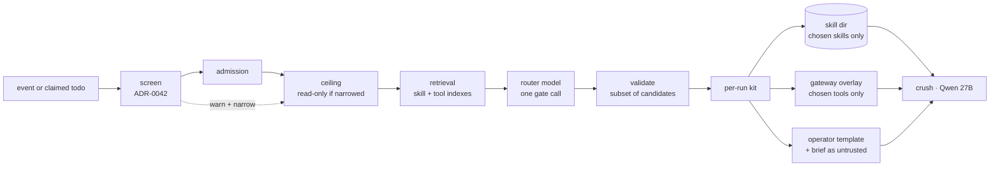
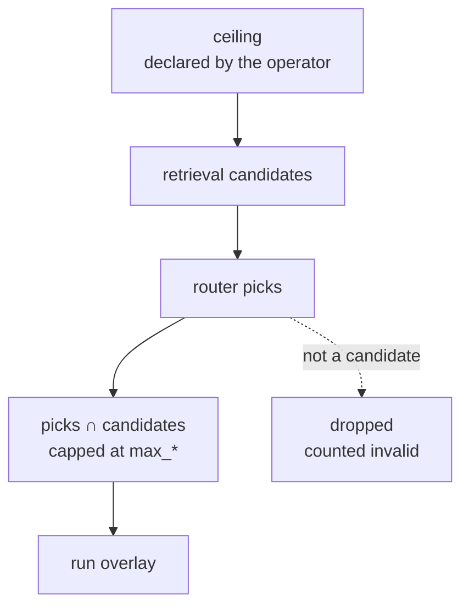

# ADR-0043: Task loadouts — a router model narrows each run's skills, tools, prompt and lane from an operator-declared ceiling

> **Not yet implemented.** Design stage. It needs five things that are also
> unbuilt:
>
> * ADR-0036's model API and skill index;
> * SPEC-0006's `skill_paths` projection;
> * ADR-0035's MCP gateway;
> * SPEC-0017's prompt templates;
> * the dispatcher in #541, for lanes only.
>
> SPEC-0032 formalizes it.

## Context and Problem Statement

Queue work in the fleet increasingly runs on small open-weight models:
long-lived Crush workers on a LiteLLM-served Qwen 27B drain Switchboard queues.
Each harness's reach is fixed once for every task it will ever run: every
projected skill (SPEC-0006), its whole MCP policy (ADR-0035) and its allowed
tools. For a frontier model with a very large context window that is only
wasteful. For a 27B model it can decide whether the run works at all, for three
reasons:

* Every skill description and tool schema is context the model pays for on
  every turn.
* Tool-choice accuracy falls as the tool list grows.
* A small model rarely decides on its own to call `search_skills` or
  `search_tools`. ADR-0030's search-served skills and ADR-0035's `lazy`
  exposure both assume an agent that knows when to look.

A fixed reach is also the opposite of least privilege. A run that labels an
issue holds the same write tools as a run that fixes one. When the task text
is hostile, the tools it can reach are exactly what an injection gets to use.
ADR-0042 screens that text, but a `warn` verdict still runs with full reach.

A cheaper model could read the task first and hand the worker a smaller kit:
the three skills that apply, the eight tools it needs, a prompt written for
that kind of task, and a short restatement of the task. ADR-0036 forbids a
daemon model call from selecting config. ADR-0042 added gate calls, which may
narrow but never widen, and named the entry points where one may be waited on.

Can a model choose, per unit of work, a smaller kit than the harness's full
reach, so that its choice can never widen that reach and its prose never
becomes operator instructions?

## Decision Drivers

* **Narrow only.** The router picks a subset of what the operator declared,
  called the **ceiling**. It never adds a skill, tool, server, template or lane
  that is not declared. A steered router can at worst under-provision, so the
  run fails, or pick the whole ceiling, which is the status quo.
* **Skills are relevance; tools are privilege.** Skill text grants nothing.
  ADR-0030 calls `serve_to` "relevance scoping, not access control". So a
  skill the router missed can be recovered by search. A tool outside the
  loadout must stay unreachable for the whole run.
* **Untrusted input never becomes operator instructions** (ADR-0021, ADR-0023).
  Anything the router writes derives from untrusted text and travels as
  untrusted data.
* **Deterministic first, the model last.** Retrieval over indexes that already
  exist (ADR-0036's skill index, ADR-0035's tool index) cuts the catalog to a
  short list. The model only picks from that list, and a retrieval-only mode
  needs no chat model at all.
* **One fresh process per unit of work.** A loadout applies when a one-shot
  spawns: ADR-0021's fresh context per event, or #541's one session per claimed
  subject. Nothing is reconfigured mid-session in this revision.
* **Prove it helps.** A loadout has to beat the ceiling on ADR-0036's evals, and
  a miss in production must be countable.
* **Suspicious input gets less.** An ADR-0042 `warn` can run the work with a
  read-only ceiling instead of choosing between full reach and a hold.
* **Honest per adapter.** Where a client cannot narrow something, such as a
  built-in tool, the run record says so rather than implying it did.

## Considered Options

### Decision 1 — Who chooses a run's kit

* Option 1 — The agent, at run time, through `search_skills` and
  `search_tools`: today's design (ADR-0030, ADR-0035 `lazy`).
* Option 2 — Harness, at spawn, from an operator-declared ceiling.
* Option 3 — Harness, per prompt, mid-session, through
  `notifications/tools/list_changed` and re-projected skills.

### Decision 2 — How the choice is made

* Option 1 — Retrieval only: the top results from the skill and tool indexes.
* Option 2 — A model over the whole catalog.
* Option 3 — Retrieval narrows each axis to a candidate list and a model picks
  among the candidates, with retrieval-only available as a mode.

### Decision 3 — What the router may change

* Option 1 — Anything a harness table can set.
* Option 2 — Subsets of the ceiling on four axes: skills, MCP tools, prompt
  template and lane. Nothing else.
* Option 3 — Skills only.

### Decision 4 — How the router shapes the prompt

* Option 1 — It picks an operator-written template by name and fills typed
  slots from declared label sets.
* Option 2 — Option 1, plus a bounded **brief** the router writes, delivered as
  untrusted data.
* Option 3 — The router writes the prompt.

## Decision Outcome

Chosen: **Decision 1 → Option 2** (Harness, at spawn), **Decision 2 → Option 3**
(retrieval, then a model pick), **Decision 3 → Option 2** (four axes, subsets
only), **Decision 4 → Option 2** (templates plus a fenced brief).

In one sentence: a harness names a **loadout**. When a one-shot of that harness
fires with an event, the daemon does four things between opening the run and
spawning it:

1. retrieves candidate skills and tools from the harness's own ceiling;
2. makes one gate call in which a router model picks a template, a task family,
   a few skills, a few tools and a short brief;
3. drops every name it did not offer;
4. spawns the agent with only those skills projected, only those tools on its
   gateway session, the chosen operator template, and the brief as untrusted
   data.

A dispatcher handling unbound work can also let the router pick which harness
(lane) runs it.

### The loadout table

```toml
# ~/.config/harness/harness.toml, global only
[loadout.small]
mode            = "model"          # model | retrieval
model           = "qwen3-30b-a3b"  # an ADR-0036 [model_api] chat model; exact id
timeout         = "20s"            # retrieval + router; a 1,200-char brief takes seconds on a local 30B
candidates      = 12               # retrieval top-k per axis, before the model picks
max_skills      = 3
max_tools       = 8
families        = ["bug", "feature", "docs", "question", "chore"]  # declared labels
brief           = "file"           # off | file | inline
brief_max_chars = 1200
fallback        = "ceiling"        # ceiling | minimal

[loadout.small.template.triage]
file        = "~/.config/harness/prompts/triage.md"   # a SPEC-0017 prompt template
description = "Label, size and route a new issue. No code changes."

[loadout.small.template.fix]
file        = "~/.config/harness/prompts/fix.md"
description = "Reproduce and fix a bug on a branch, with a test, and open a PR."

[harness.qwen-worker]
harness     = "crush"
model       = "litellm/Qwen3.8-27B"
description = "Small local worker for triage and small, well-scoped fixes."
triggers    = ["channel.sb"]
loadout     = "small"
mcp_policy  = "worker"             # the tool ceiling (ADR-0035)
prompt_template_file = "~/.config/harness/prompts/worker.md"   # the default template
```

* `[loadout.*]` joins ADR-0009's global-only list. `loadout` on a harness is
  allowed where `triggers` is allowed: the global file and `harness_d`
  drop-ins. A loadout needs an event, and project files and package manifests
  cannot bind triggers, so both reject the key.
* A loadout applies only to a one-shot that carries an event. A scheduled
  firing, or a manual trigger without `--event`, runs with the ceiling and
  records `fallback = no_event`. `loadout` on a resident harness is a load
  error.
* Templates are ordinary SPEC-0017 prompt templates: the same grammar, the same
  context and the same untrusted-field rules. Each `description` is operator
  prose shown to the router. The harness's own `prompt`, `prompt_file` or
  `prompt_template*` is the default template, used whenever the router picks
  none or a fallback applies.

### The ceiling, axis by axis

| Axis | Ceiling | What the loadout does | Delivered by |
|---|---|---|---|
| Skills | The harness's merged, projected skill set (SPEC-0006), a stable's bundled skills included. Skill-repo skills are not on the axis: they stay search-served, as today | Chooses at most `max_skills` | The harness's managed skill directory, reconciled to only those skills before the spawn. `search_skills` and `get_skill` can still reach the rest of the ceiling |
| MCP tools | The harness's effective `mcp_policy` tool set (ADR-0035) | Chooses at most `max_tools` | A per-run overlay on the gateway session: its `tools/list`, `search_tools` and `call_tool` see only the overlay |
| Template | The loadout's named templates plus the harness's default | Chooses one | SPEC-0017 rendering, as today |
| Lane | `lanes`, a list of harness names, only for unbound work | Chooses one | The dispatcher starts that harness, whose own ceiling and loadout then apply |

* **Skills and tools are treated differently on purpose.** A skill miss is
  recoverable: the agent can still search, and the search is counted as a miss.
  A tool outside the overlay is refused with the gateway's `not_permitted`
  error and counted as a miss. There is no way to reach it for that run.
* **Built-in tools are not chosen by the router in this revision.** Each client
  family names its tools differently, and some cannot restrict them at all.
  Only the `narrow` level below touches them, and only where the family
  declares a read-only set.
* **One managed skill directory per harness, never one per run.** SPEC-0006
  projects the whole merged set into a target that every harness of a family
  shares, so a loadout cannot narrow there. A harness that selects skills
  instead owns one directory:
  * It is **bootstrapped** on the harness's first qualifying spawn.
  * It is **reconciled** before every spawn to exactly that run's set: the
    chosen skills, none, or the ceiling. Reconciling copies what differs,
    deletes what is not in the set, and writes a manifest.
  * It is **collected** when the harness stops using a loadout, and swept at
    daemon start.

  Reconciliation is idempotent, so a run that fails, is killed or crashes the
  daemon leaves nothing to clean up: the next spawn corrects the directory.
  This is safe because a harness never runs two processes at once
  (SPEC-0014). When the dispatcher lifts that (#541), the rule becomes one
  directory per concurrency slot, still a fixed pool. An adapter family
  declares how to point a process at the directory: a flag, an environment
  variable, or a config file written once at bootstrap (ADR-0039). A family
  that cannot do that keeps loadout skill selection off, and records it on the
  run.

### Choosing a loadout

```text
event text ──► retrieval (per axis, top `candidates`) ──► router model (one gate call)
          ──► validate against the candidates ──► narrow if suspicious ──► spawn
```

1. **Task text** is drawn only from the text ADR-0042 screens for that event,
   by the same rules whether or not screening is on. For a forge event it is
   the title, body, comment and ref. For any other source it is the whole
   screened text. Screening covers every string the sender wrote, but the
   router needs only what the task is about, and it never reads text screening
   did not see. For the dispatcher, the claimed todo's coalesced events are
   the input, as its own amendment defines.
2. **Retrieval** runs the task text against ADR-0036's hybrid skill index,
   limited to the harness's projected set, and ADR-0035's tool index, limited
   to its policy. Each axis gets the top `candidates`. In `retrieval` mode the
   top `max_skills` and `max_tools` are used directly, the default template
   applies and no brief is written: no chat model is called.
3. **The router call** is one gate call to `model` (ADR-0042) with a fixed
   system prompt owned by Harness. The candidates' names and descriptions are
   in the prompt as a catalog:
   * template descriptions come from the operator;
   * skill descriptions come from the operator or a package author;
   * tool descriptions come from upstream MCP server authors, trimmed as
     ADR-0035 trims them.

   The task text is inside SPEC-0017's untrusted fence. The response is a JSON
   object `{template, family, skills, tools, brief}`, requested with a JSON
   schema where the endpoint supports one and parsed strictly either way.
4. **Validation** keeps only what the ceiling allows:
   * a name that was not a candidate is dropped and counted as `invalid`;
   * lists are cut to `max_skills` and `max_tools`;
   * an undeclared template means the default template;
   * an undeclared family is omitted;
   * the brief is stripped of control characters and capped at
     `brief_max_chars`, exactly as SPEC-0017 REQ-10 treats a fenced value.
5. **Failure** (timeout, transport error, unparseable output, a served model
   that is not `model`, or an index error during retrieval) applies
   `fallback`:
   * `ceiling` runs the harness exactly as configured, the status quo;
   * `minimal` runs the default template with no projected skills and no
     upstream MCP tools, only the facade's read tools.

   Either way the record names the reason.

The router call happens after admission and before spawn, so it is never inside
the admission lock. It is waited on only by the spawn of a one-shot that names
a loadout: the third entry point in ADR-0042's closed list.

### Prompt shaping: templates and a fenced brief

The router never writes operator instructions. It chooses **which** operator
instructions apply, and it may add a **brief**: a compact restatement of the
task for a small context window, written from untrusted text and treated
exactly as that text is.

* `brief = "file"` (the default) writes the brief `0600` beside the run's event
  file as `<run_id>.brief.md`. Its path is exported as `HARNESS_BRIEF_FILE` and
  available as `{{loadout.brief_file}}`. The template decides whether to point
  the agent at it.
* `brief = "inline"` makes it available as `{{untrusted loadout.brief}}`, only
  on a harness that also sets `untrusted_inline = true` (SPEC-0017 REQ-10). No
  new key opens the fence. The fenced brief then goes wherever the rendered
  prompt goes. For an adapter that passes its prompt as an argument, that is
  argv, as SPEC-0017's fenced event text already is. That is why `file` is the
  default.
* `brief = "off"` asks the router for no brief.
* The template context gains `loadout.template`, `loadout.family`,
  `loadout.skills` and `loadout.tools`: operator-declared identifiers, never
  free text. `loadout.lane` is added for a lane choice.
* The brief carries the event's ADR-0042 verdict and is not screened again. It
  can say nothing the screened payload could not, and it arrives the same way.

### The `narrow` level

This ADR adds `narrow` to ADR-0042's levels, between `notify` and `hold`:

| Level | Effect |
|---|---|
| `narrow` | `notify`, and the run proceeds with a **read-only ceiling**. Write-tier tools leave the tool ceiling before anything is chosen (ADR-0035 tiers, where an unannotated tool counts as write). Where the family declares a read-only built-in set, the agent cannot use a built-in tool outside it |

* `narrow` needs no router model. A harness without a `loadout` can still set
  `on_warn = "narrow"`, and the overlay mechanics apply on their own.
* The recommended setting for a public source is `on_warn = "narrow"`,
  `on_flag = "hold"`. ADR-0042's defaults (`notify`, `hold`) are unchanged.
* A family with no declared read-only built-in set records
  `builtin_tools = "unnarrowed"` on the run. A flag the client treats as a
  permission hint, which `auto_accept` then bypasses, does not count as a
  read-only set.

### Lanes: choosing who does the work

The dispatcher (#541) claims a todo before any harness is bound to it. A
loadout with `lanes` lets the router choose the harness:

```toml
[loadout.queue]
mode  = "model"
model = "qwen3-30b-a3b"
lanes = ["qwen-worker", "claude-worker"]   # each harness's description is its catalog entry
```

* The lane call is one gate call that picks one name from `lanes`. The chosen
  harness's own admission, ceiling and loadout then apply. Lane selection and
  kit selection are two separate calls, and neither widens the other.
* A name outside `lanes`, or any failure, picks the first lane. Put the
  cheapest safe default first.
* `lanes` on a loadout that a harness names directly is a load error: a
  triggered harness is already bound to its work.
* How the dispatcher names a loadout is its own amendment to ADR-0021 (#541).
  This ADR fixes only what a lane choice may do.

### Recording and measuring

* **The run record** (SPEC-0022 REQ-4) gains a `loadout` object: `name`,
  `mode`, `template`, `family`, `lane`, `skills`, `tools`, `narrowed`,
  `builtin_tools`, `mcp_tools`, `fallback`, `invalid`, `served_model`,
  `degraded`, `duration_ms` and `brief_hash`. Names are operator-declared identifiers, capped like other
  lists at 16 entries and 256 bytes. The brief never enters the ledger; only
  its hash does. The brief file is pruned with the run's event file.
* **Misses:**
  * the agent loading a ceiling skill the loadout left out, through
    `search_skills` or `get_skill`, is a `skill` miss;
  * a gateway refusal of a ceiling tool outside the overlay is a `tool` miss.

  Both are joined to the run record, and `harness loadout misses` lists them.
* **Explain:** `harness loadout explain <harness> --event FILE` shows the
  decision a saved event would get, including candidates, invalid names and
  the fallback, and spawns nothing. It is still a real, metered router call.
* **Evals:** an ADR-0036 case can run a `loadout` arm and a `ceiling` arm, which
  records pass rate, tokens and cost side by side. That is how a loadout
  proves it helps a given model before it is turned on for a queue.
* **Metrics** (SPEC-0013):
  * `harness_loadout_decisions_total{loadout, outcome}`;
  * `harness_loadout_duration_seconds{loadout}`;
  * `harness_loadout_items{loadout, axis}`;
  * `harness_loadout_misses_total{harness, axis}`;
  * `harness_loadout_invalid_total{loadout}`.

### Consequences

* Good, because a small model starts with three skill descriptions and eight
  tool schemas instead of every one its harness can reach. That is where a
  27B model's context and tool accuracy are won or lost.
* Good, because every run gets least privilege for its task. A triage run holds
  no merge tool even when its harness can merge.
* Good, because a steered router cannot widen anything. Its worst outcomes are a
  failed run, or the ceiling, which is what runs today.
* Good, because a suspicious event can run read-only instead of choosing
  between full reach and a hold.
* Good, because `retrieval` mode delivers most of the context saving with no
  chat model and no new failure mode beyond the indexes.
* Good, because evals and miss counts show whether a loadout helps a given model,
  rather than assuming it does.
* Good, because lanes let the cheap model take the easy work, and the choice is
  bounded to harnesses the operator declared.
* Bad, because every routed run waits for a model call before it spawns:
  seconds for a 30B router. `retrieval` mode and `timeout` bound this.
* Bad, because a router miss looks like an agent failure unless someone reads
  the miss counts. A too-tight `max_tools` turns into failed runs.
* Bad, because the brief is a new channel for injected text into the agent.
  It is bounded, fenced, never operator instructions, and no more trusted than
  the payload it came from, but it exists.
* Bad, because it depends on five unbuilt pieces, and pointing each client
  at a managed skill directory is new, client-specific mechanics.
* Bad, because templates multiply the prompts an operator maintains.
* Bad, because built-in tools, the widest exfiltration path, are narrowed only
  by the `narrow` level and only for families that declare a read-only set.
* Neutral, because agents keep `search_skills` over the full skill ceiling, so
  a loadout never hides a skill for good.

### Confirmation

SPEC-0032 formalizes the loadout table, the ceiling per axis, candidate
retrieval, the router call and its validation, fallback, the brief and its
delivery, the `narrow` level, lanes, recording and misses.

Acceptance tests that matter:

* A router response naming a tool outside the ceiling leaves that tool out of
  the run's `tools/list`, and records `invalid = 1`. A router response naming
  every ceiling tool yields at most `max_tools`, all from the ceiling.
* A router that times out under `fallback = "ceiling"` spawns the run with the
  full ceiling and records `fallback = timeout`. Under `minimal`, the run has no
  projected skills and only facade read tools.
* Under `brief = "file"`, a canary string planted in the event body and echoed
  by a fake router into the brief appears in `HARNESS_BRIEF_FILE`. It never
  appears in argv, in the rendered prompt, or in any ledger line.
* With `on_warn = "narrow"` and a `warn` verdict, the run's gateway session
  lists no write-tier tool. Where the family declares a read-only built-in set,
  the agent cannot run a built-in tool outside it. The test drives the real
  client with `auto_accept` on, rather than reading its argv.
* Two consecutive runs of one harness with different loadouts each see only
  their own projected skills, never the previous run's or the rest of the
  ceiling.
* After a run is killed and the daemon crashes, the next spawn finds the
  harness's managed skill directory holding exactly its own set, with a
  matching manifest, and no other skill directory exists. Removing the
  harness's `loadout` removes the directory, checked by `stat`.
* `mode = "retrieval"` makes zero chat calls, counted at a fake model server.
* `loadout` on a resident harness, in a project file or in a package manifest
  fails, naming the key. So does `lanes` on a loadout a harness names.
* A lane response naming a harness outside `lanes` starts the first lane, never
  the named one.

## Pros and Cons of the Options

### Decision 1

#### Option 1 — The agent chooses, at run time

* Good, because it needs nothing new, and it is right for a frontier model that
  searches well.
* Bad, because a small model rarely searches when it should, and pays for
  whatever is listed eagerly.
* Bad, because it is not least privilege: every tool in the policy stays
  reachable for every task.

#### Option 2 — Harness chooses, at spawn (chosen)

* Good, because a one-shot starts fresh, so there is no session state to
  reconcile, and the choice is made once and recorded.
* Good, because the ceiling is enforced where the tools are served (the
  gateway), not by asking the agent to behave.
* Bad, because a mis-chosen kit cannot be corrected mid-run except by skill
  search.

#### Option 3 — Harness chooses per prompt, mid-session

* Good, because it would serve resident sessions, not only one-shots.
* Bad, because skills are projected at start and most clients do not reload
  them, and `list_changed` churns a session's tool list and prompt cache.
  ADR-0035 went out of its way to avoid that churn.
* Neutral, because it can be added later for MCP tools alone, on the same
  overlay.

### Decision 2

#### Option 1 — Retrieval only

* Good, because it is deterministic, cheap and needs no chat model.
* Bad, because it cannot choose a template or write a brief, and ranks by
  surface similarity rather than by what the task needs.
* Neutral, because it is kept as `mode = "retrieval"`.

#### Option 2 — A model over the whole catalog

* Good, because the model sees everything.
* Bad, because the catalog is the very context cost this ADR exists to cut,
  now paid on every routing call.

#### Option 3 — Retrieval, then a model pick (chosen)

* Good, because the model reads a short candidate list, and every name it can
  return is known in advance, so validation is a set check.
* Bad, because a skill that retrieval ranks below `candidates` can never be
  chosen. Misses show when that happens.

### Decision 3

#### Option 1 — Anything a harness table can set

* Good, because it is maximally flexible.
* Bad, because a model steered by the task text could set `model`, `workdir`,
  `env_file` or `mcp_allow`: config chosen by an attacker.

#### Option 2 — Four axes, subsets only (chosen)

* Good, because every axis has a declared ceiling and a set check, so narrow-only
  is provable per axis.
* Bad, because some useful choices, such as a per-task `max_turns` or model
  size, are out of reach. Lanes cover the model-size case.

#### Option 3 — Skills only

* Good, because skills grant nothing, so it carries the least risk.
* Bad, because it leaves the security half of the problem, tool reach,
  untouched.

### Decision 4

#### Option 1 — Templates only

* Good, because it is completely safe: the router picks a name and nothing it
  writes reaches the agent.
* Bad, because the small model still reads the full, often noisy payload with
  no compact restatement.

#### Option 2 — Templates plus a fenced brief (chosen)

* Good, because the small model gets a focused operator prompt and a short
  task summary.
* Good, because the brief travels exactly like the payload it came from:
  fenced, capped, never in the ledger, and inline only by the same opt-in that
  fenced event text needs.
* Bad, because the brief is one more channel an injection can use, and it is no
  safer than the payload it summarizes.

#### Option 3 — The router writes the prompt

* Good, because it is the most adaptive.
* Bad, because it launders untrusted text into operator instructions, the
  exact boundary ADR-0021 and ADR-0023 exist to hold.

## Architecture Diagram

A routed run, from a claimed todo or an event to the agent:



The ceiling and the overlay, per axis:



## More Information

* **Extends ADR-0042:** the router and lane calls are gate calls, and `loadout`
  is the third entry point on its closed list. `narrow` is a level between
  `notify` and `hold`.
* **Extends ADR-0036:** retrieval uses its hybrid skill index. Misses and eval
  arms feed its efficacy measures. The router model is a `[model_api]` chat
  model.
* **Extends ADR-0035:** the per-run overlay narrows a session below its
  `mcp_policy`, and a run's gateway session is identified by its run id.
  `list_changed` is not used: a one-shot's overlay is fixed before it spawns.
* **Extends ADR-0021:** loadouts apply to event-carrying one-shots. Lanes apply
  to the dispatcher's unbound work (#541), whose own amendment says how a queue
  names a loadout.
* **Related ADR-0011 and ADR-0039:** per-run projection and an adapter family's
  read-only built-in set are adapter declarations.
* **Related ADR-0023:** templates and the fence are SPEC-0017's, unchanged. The
  brief opens nothing new.
* **Related ADR-0026:** the router's served model is attested like any pinned
  model, and a mismatch is a fallback.
* **Related ADR-0030 and ADR-0044:** a stable's bundled skills are part of the
  skill ceiling. Skill-repo skills stay search-served and off the axis. A
  package cannot declare a loadout.
* **Deferred:**
  * mid-session MCP narrowing for resident harnesses;
  * router-chosen built-in tools;
  * per-task `max_turns` or budget;
  * screening the brief as its own entry point;
  * letting a package ship templates for a loadout.
