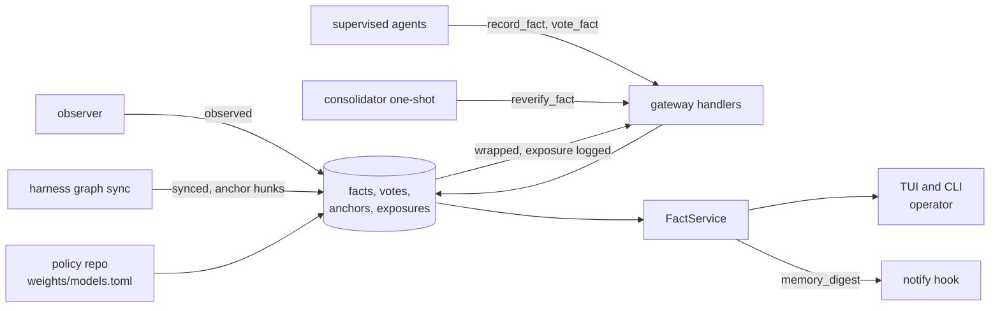
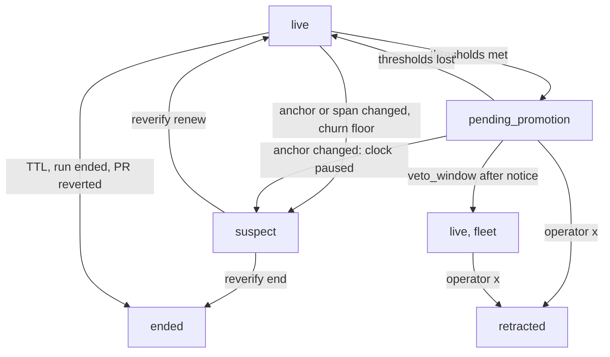
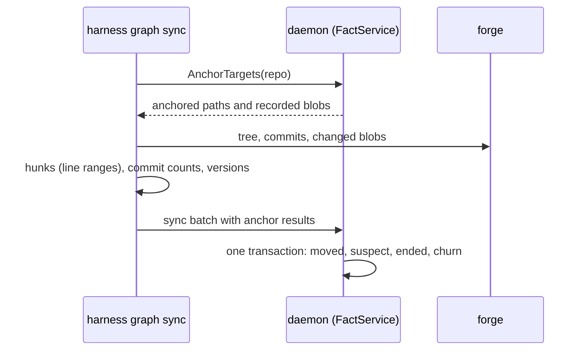

# Design: Fleet Facts

## Context

ADR-0041 gives Harness a memory of the fleet's own work in three parts: a
deterministic graph (SPEC-0027), facts (this spec), and rules (SPEC-0029), with
episodes and briefings behind a pluggable provider (SPEC-0030). Facts are the
part agents write. A fact such as "this repo's CI runner has slow fsync, so
ledger-bound tests flake" today lives in one agent's private memory, keyed to
one adapter. Here it becomes a row every adapter in the same repository can
recall, that expires when the code under it moves, and that reaches the whole
fleet only when independent runs agree and the operator has had a chance to
object.

Skills (ADR-0012, ADR-0030) already carry shared knowledge, through merged pull
requests and blind verification. That gate is right for instructions and too
slow for descriptive facts that go stale in days. Facts therefore get a lighter
gate, and in exchange they never become instructions: they are served wrapped
as data (SPEC-0027 REQ "Memory Data Wrapper"), capped at 280 characters, never
rendered as steps, and never count as SPEC-0007 grounding evidence.

Related: ADR-0037 (the store and its triggers), ADR-0035 (the gateway and its
call log), ADR-0034 (ConnectRPC tiers), ADR-0013, ADR-0026 and ADR-0027 (the
consolidator is a pinned, budgeted scheduled one-shot), ADR-0009 (global-only
tables), SPEC-0005 REQ "Caller Identity", SPEC-0007 REQs "Staleness
Re-Verification" and "Review Feedback And Suppression".

## Goals / Non-Goals

### Goals

* A fact one run records is recallable by every adapter in its repository at
  once, with its source, trust and anchors attached.
* Nothing an agent writes can act, grant, or reach another repository without
  independent corroboration and a veto window the operator actually saw.
* Staleness follows the code: anchored facts survive while their code is still
  and wear down as it churns.
* Every number (confidence, weight, support, threshold) is a pure function of
  stored rows and one weights snapshot, so `harness facts why` can show it and a
  test can reproduce it.
* The store, not only the handlers, refuses the two writes that matter most.

### Non-Goals

* **A general knowledge base.** No documents, feeds or web pages; ADR-0041's
  scope fence holds. Web and issue text can be cited, and only taints.
* **A judge model.** No model decides whether a fact is kept, promoted or true.
* **Free-form predicates.** The vocabulary is closed and ships with the binary.
* **Automatic demotion of fleet facts.** Contradictions after promotion go to
  the feed; the operator retracts.
* **Sharing facts between Harness installations** (deferred by ADR-0041).

## Decisions

### One table with a `kind` column and triggers, not two tables

**Choice**: all four kinds share `facts`; two triggers refuse a vote on a
non-asserted fact and any `UPDATE OF kind`; a third pins a vote's `fact_id`.

**Rationale**: recall, the timeline, anchors, expiry and the inspector treat
every kind the same way, and one query answers "what do we know about this
file". Two tables (deterministic vs asserted) would duplicate every one of
those paths and make a union the common case. The only thing that differs by
kind is who may write and whether votes apply; the first is a handler check
(the daemon is the only SQL writer, so SQLite cannot tell callers apart), and
the second is exactly what a trigger can enforce. Making `kind` immutable
closes the obvious bypass, which is inserting as `asserted`, collecting votes,
then relabelling. ADR-0037 anticipated these hand-written triggers.

**Alternatives considered**: separate `asserted_facts` and `system_facts`
tables, rejected for the duplication; CHECK constraints alone, rejected because
a CHECK cannot look at another table's row.

### Independence matters more than weighting

**Choice**: promotion requires distinct repositories, families and runs as
hard minimums, caps each family's weighted support, and discards votes from
runs that were shown the fact. Weights only decide between cases that already
pass those gates.

**Rationale**: the failure mode is correlated agreement. Five Claude runs that
all read the same briefing are one observation repeated; weighting them
precisely does not fix that. Minimums and the family cap bound what any one
model, family or repository contributes, whatever its weight, and the exposure
rule removes the loop in which memory corroborates itself (SPEC-0007's
"Retrieval does not reinforce itself", generalized). `min_families` and
`min_runs` cannot be set below 2, so no configuration lets one strong model
promote a fact alone.

**Exposure is its own table.** The ADR-0035 call log stores argument hashes and
never response bodies, so it cannot say which fact ids a `recall` returned.
Serving surfaces (SPEC-0027's graph tools, SPEC-0030's recall and briefings)
write `fact_exposures` rows, keyed to the call log row, and commit them before
responding; a fact whose exposure cannot be recorded is not served. That keeps
the check exact and fail-safe, and the `call_id` keeps it auditable against the
call log. This spec owns the table; the serving specs only say when they
write.

### Weights: a pinned public prior, corrected by local record

**Choice**: `w0` from a min-max-normalized mean of public benchmark scores,
mapped into `[prior_min, prior_max]`; a per-family beta-binomial multiplier
from facts that family supported which reached fleet scope unretracted versus
were retracted. The snapshot lives in the policy repo and is copied into
`weight_snapshots` by content hash when loaded.

**Rationale**: benchmarks measure coding, not honest reporting (ADR-0041 says
so), so they are only a bounded starting point: a 3:1 spread at most. The local
record is what the fleet actually learns, and the beta prior (4, 1) keeps one or
two retractions from crushing a family. Storing the snapshot as a row makes the
computation a function of rows alone. The per-benchmark normalization avoids
comparing raw percentages from benchmarks of different difficulty.

### The veto clock starts at notice, not at pending

**Choice**: `notice_at` is set only by an operator caller's `ListPending` or an
`ok` delivery of a `memory_digest` naming the fact. No notice, no clock.

**Rationale**: a window that runs while nobody is looking is not a veto. An
operator on holiday, a hook pointed at a dead endpoint, or a TUI never opened
would all promote facts unseen. Starting at notice makes silence mean "seen and
not objected to". `internal/notify` today reports delivery outcomes only to
metrics, so it gains a per-notification result callback; a dropped, suppressed,
failed or timed-out digest starts nothing, and the next digest repeats the
fact. `memory_digest` is opt-in (not in the default `events`), so existing hooks
see no new traffic.

### Churn, not time

**Choice**: anchored facts have no TTL. Each counted commit touching an anchored
path multiplies confidence by `churn_decay`; a span change or deleted path makes
the fact suspect at once; confidence below `churn_floor` does the same. Only
unanchored facts expire by time, and re-observation renews them.

**Rationale**: facts about code go stale when the code changes. A TTL ends true
facts about a file nobody touched and keeps false ones about a file rewritten
twice last week. Counting commits instead of elapsed days gives the right
answer in both cases, and is deterministic from synced history. Time remains
the only signal for facts with nothing to anchor to, which is why untrusted
unanchored facts get the short 7-day TTL.

### Anchors resolve from synced data, not from the agent

**Choice**: blob SHAs and base commits come from the last synced default-branch
tree, dependency versions from synced `depends_on` edges, and agent versions
from the writing run's ledger record, which the daemon fills by probing the
binary it exec'd (SPEC-0027 REQ "Agent Version Recording"); unresolvable
anchors are stored `unresolved`, and the fact runs its TTL until a sync
resolves them. Span checks use the line ranges, commit counts and versions
that `harness graph sync` computes (SPEC-0027 REQ "Graph Sync"); no file
content reaches the daemon.

**Rationale**: an agent on a feature branch sees a different blob than the
default branch, and a caller-supplied SHA would be both wrong and forgeable.
The daemon cannot fetch (ADR-0041), so the client that holds the forge
credential computes hunks, and the daemon applies SPEC-0007's span rule to
numbers. A span untouched by a commit is relocated, not made suspect.

### Promotion by group key with one representative

**Choice**: facts are deduplicated per project; promotion groups members across
projects by `(subject, predicate, value_hash)`. The earliest trusted live member
is the representative; on promotion it becomes `fleet`, inherits every member's
anchors, and the others end as superseded.

**Rationale**: support from other repositories arrives as separate project
facts, because recall is scoped and a run cannot see another project's facts.
Grouping keeps one fact id through the veto window and after it, so the
inspector's chain and the audit trail stay intact.

### Untrusted content only ever lowers support

**Choice**: untrusted members and untrusted support votes count for nothing
toward promotion; untrusted contradictions still subtract. Consolidator output
and webhook-triggered runs are always untrusted.

**Rationale**: fail-safe in both directions. Injected text can at worst keep a
fact in its project, never push one to the fleet. The consolidator reads other
agents' traces, which is where injected text arrives (ADR-0041).

### Thresholds in global config, weights in the policy repo

**Choice**: `[memory.promotion]` thresholds are hand-edited global config; the
snapshot and family mapping are policy repo files changed by pull request.

**Rationale**: both are operator-owned (ADR-0041 "Where the human is"), but
keeping thresholds out of the policy repo means an automated weights refresh
pull request cannot also lower a threshold in the same diff.

## Architecture

Where facts come from and where they go:

A fact's statuses and what moves it:

Anchor checking on sync:

## Risks / Trade-offs

* **Gaming by homogeneous fleets.** Many similar models on many similar
  repositories can meet minimums. → Family cap, `unknown` as one family,
  exposure discounting, and the veto window bound it; ADR-0041 accepts the rest.
* **A poisoned fact is live in its project before anyone looks.** → Wrapped as
  data, 280-character cap, untrusted flag, 7-day TTL when unanchored, never
  promoted without the operator, and one-keystroke retraction.
* **The operator-caller check is best effort.** An agent is the same Unix user
  and can detach from its process tree. → The check stops casual and accidental
  cases; ADR-0004 already places the trust boundary at the user.
* **An operator-role machine client starts clocks.** A dashboard polling
  `ListPending` over TCP counts as notice. → Documented; a client that only
  displays counts should use `ListFacts`.
* **Retraction by one key is easy to misfire, and is sticky.** → The operator
  can assert an `operator` fact to restore the content; the retraction's
  effect on family weights stays, which is accepted.
* **`workaround` values read like instructions.** → They stay quoted data and are
  never rendered as steps; the predicate describes, it does not direct.
* **Store growth.** Votes and exposures grow with runs. → Exposures and votes
  are kept while their fact exists; ended and retracted facts older than the
  suppression period may be pruned by a retention key this spec leaves to the
  store's retention pass (ADR-0037).

## Migration Plan

1. **Depends on ADR-0037's store**, which is not built. Nothing here ships
   before it: the tables, triggers and indexes arrive as one goose migration,
   and `Store` gains a `Facts()` part.
2. **Depends on SPEC-0027** for subjects (including `tool` and `dependency`
   nodes), repo keys, `harness graph sync` and its anchor data, and the data
   wrapper. Until graph sync carries anchor data, every anchor is `unresolved`
   and facts behave as unanchored.
3. **Depends on ADR-0035's gateway** for `record_fact`, `vote_fact`,
   `reverify_fact` and caller attribution. `FactService`, `harness facts` and
   operator-asserted facts can ship before the gateway, because they need only
   the store and the control plane.
4. `internal/notify` gains the delivery-result callback and the `facts` payload
   field (a new field under payload version 1); `memory_digest` is added to
   `docs/usage/notify.md`.
5. Promotion ships last, after SPEC-0029's policy repo exists. Without a
   `weights_repo`, every model is in the one family `unknown`, so
   `min_families = 2` cannot be met and nothing promotes: the operator's
   `harness facts assert --supersedes` is then the only way to `fleet` scope,
   which is conservative by construction.

## Open Questions

* **What counts as "upheld".** This spec counts only facts that reached fleet
  scope unretracted. Facts that lived out their project life unretracted are
  also weak evidence of reliability; counting them would reward volume.
* **TUI entry point.** The fact views need a key or palette entry that does not
  collide with SPEC-0027's graph views; `F` is free today.
