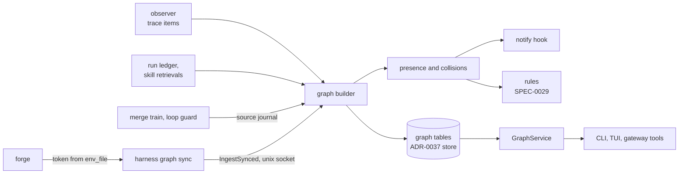
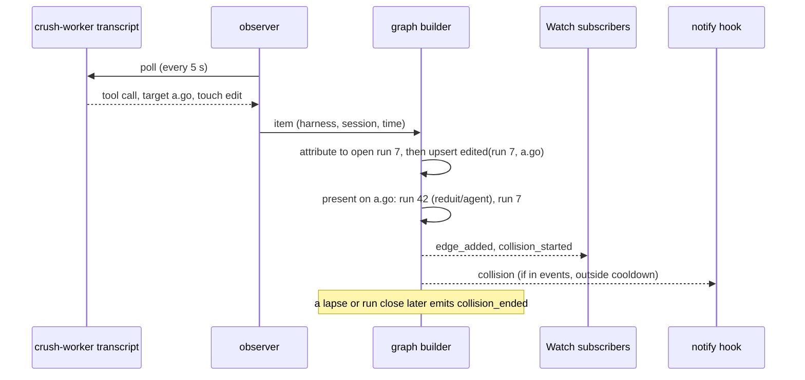

# Design: Fleet Graph

## Context

Harness already reads almost everything the fleet graph needs, and keeps
almost none of it in a form anything can join:

* The observer (`internal/observe`) polls every supervised agent's transcripts
  through agent-trace every five seconds and fans each classified tool call and
  mark out to subscribers. Each `classify.Event` carries repo-relative
  `Targets` with a touch (`edit`, `read`, `hit`), an `Action` (including
  `verify`) and an `InputDigest`. It delivers each item once and keeps nothing.
* The loop guard (`internal/loopguard`) is one of those subscribers. It keeps a
  per-harness streak of identical calls in memory and records trips in a slice
  that dies with the daemon.
* The run ledger (SPEC-0022) records runs with trigger, source, outcome and
  sessions, and attributes observer items to "the run open for its harness at
  the item's time". It records nothing a run touched.
* The merge train (`internal/mergetrain`, ADR-0032) knows which pull requests
  are queued on which repo and logs each transition; nothing persists them or
  joins them to the runs that wrote the code.
* The notify hook (`internal/notify`, SPEC-0003) delivers operator events with
  a per-(harness, event) cooldown.

ADR-0041 decides that these become one graph, built by code, and that the
graph is the deterministic half of fleet memory. SPEC-0028 (facts), SPEC-0029
(rules) and SPEC-0030 (providers and briefings) build on it: facts take graph
nodes as subjects and graph sync's tree and anchor data for expiry, rules read
graph events, and every memory tool uses this spec's data wrapper.

Related: ADR-0033 (trace records, the graph's main source), ADR-0035 (gateway,
caller identity, call log), ADR-0037 (the store), ADR-0034 (ConnectRPC),
ADR-0021 (on-demand runs, for `harness ask`), ADR-0038 (secret references),
SPEC-0007 (provenance and pull-request linking), SPEC-0013 (metrics),
SPEC-0001 (the TUI and the hop).

## Goals / Non-Goals

### Goals

* Answer "who else is editing this file or branch right now" within one
  observer poll, from records the daemon already reads, with no model.
* Make the graph reproducible: a rebuild from stored records gives the same
  digest, so the graph can be trusted as a projection and tested as one.
* Keep forge credentials out of the daemon while still joining runs to pull
  requests, merges, reverts and reviews.
* Define, once, the wrapper every memory surface uses to hand data to an agent.
* Give the operator a legible way to walk the graph: the hop, applied to nodes.

### Non-Goals

* **Open-ended extraction.** No model adds node or edge kinds. The vocabulary
  ships with the binary and changes with a release.
* **Anything outside the fleet's own work.** No documents, feeds or web pages
  (ADR-0041's scope fence).
* **A general graph query language.** Queries are fixed RPCs with bounded cost;
  `Path` has a hop and visit budget.
* **Blocking anything.** The graph observes. Acting on a collision is a
  SPEC-0029 rule's job, gated by the operator's enforce list.
* **Forges other than Gitea in this revision.** `[graph.forge.*] kind` exists so
  a GitHub reader can be added without a schema change.

## Decisions

### The graph is a projection of stored records

**Choice**: every node and edge except synced records is derived from records
another component already stores (ledger, trace events, provenance, skill
retrievals) or from the graph's small source journal. `harness graph rebuild`
re-derives everything and the digest proves it.

**Rationale**: a derived graph can be thrown away and rebuilt when its schema,
its vocabulary or a bug in its builder changes, with no migration of meaning.
It cannot drift from the records it summarises without the digest showing it.
It also makes the live path's failures recoverable: the observer is allowed to
drop items under load (ADR-0007), and reconciliation at run close repairs a
run's edges from the stored trace events, so a dropped edit costs latency, not
truth. Taking `observed_at` from the source record rather than the write clock
is what makes a live-built graph and a rebuilt one byte-identical.

**Alternatives considered**: the graph as its own system of record, written
once by the observer. Rejected: the first builder bug would be permanent, and
the ADR's acceptance test (two rebuilds, one digest) would be meaningless.

### A source journal for the two in-process sources

**Choice**: merge-train queue transitions and loop-guard trips are written to a
graph-owned journal as they happen, and rebuild reads them like any other
source.

**Rationale**: ADR-0041 names the merge train as the source of `queued` edges,
and `am_i_looping` and `harness why` need past loop stops. Neither component
persists these today: the train logs, the guard keeps a slice. A journal of
append-only rows is the smallest change that keeps the projection property; it
is the graph recording its input, not its output.

It is also the one capture: SPEC-0029's rule journal copies loop-guard trips
from it rather than subscribing to the guard a second time.

**Alternatives considered**: adding a loop-stop reason to the ledger
(amending SPEC-0022) and a transition table to the train (amending SPEC-0025).
Cleaner ownership, but two amendments for data only the graph and rules read.

### Graph sync is a client command

**Choice**: forge reads happen in `harness graph sync`, a client process that
resolves each forge's token from that `[graph.forge.*]` table's own `env_file`
(ADR-0038 resolves a reference only from its table's file) and pushes records,
including SPEC-0028's anchor data, over the Unix socket. The daemon validates
the config's shape and never opens a file.

**Rationale**: the merge train already holds a write token for the repositories
it merges. Giving the daemon read access to every repository any agent has
worked in would widen the daemon's credential surface for data it only needs to
store. A client command matches `harness distill` and `harness eval run`: the
process holding the token does deterministic work and exits. Scheduled sync
keeps that split by having the daemon exec its own binary with its
credential-free environment; the child reads the file. Ingest is limited to the
local owner on the Unix socket, and refused from supervised processes where the
peer pid is known, so synced records have one writer.

**Alternatives considered**: reusing the merge train's forge client and token
in the daemon. Rejected for the reason above, and because the train is off by
default and serves few repositories.

### Presence is computed from the observer stream, not stored

**Choice**: the graph writes `edited` edges with `observed_at`, `last_at` and a
count. Presence is a view: an open edge whose `last_at` is within
`presence_window` of now. Collisions are recomputed when an edge or session
sample changes and when a presence lapses.

**Rationale**: storing presence would put the wall clock into the graph and
break the digest. Computing it from edges means the live board, the tool, the
notify hook and a SPEC-0029 backtest all agree on what a collision was, because
all of them evaluate the same function over the same edges. Lapses need a
timer: the graph keeps a min-heap of presence deadlines and wakes at the
earliest one, so a lapse is noticed without scanning.

### Identity follows SPEC-0007's canonical-repo rule

**Choice**: a repo is keyed by its canonical `<host>/<owner>/<name>`. The
daemon derives a candidate from the origin remote with local git, and sync
resolves mirrors from forge topics, re-keying the candidate's nodes. `tool`
and `dependency` nodes carry no repo, so facts about a linter or a module share
one subject across repositories.

**Rationale**: a fleet clones mirrors and canonical copies interchangeably. Two
agents in a mirror clone and a canonical clone of the same project are editing
the same code and must collide. Resolving needs forge topics, which only sync
can read, so identity starts provisional and is corrected, never guessed. The
host is part of the key because two forges can hold the same `owner/name` as
unrelated projects, and SPEC-0028's `project:<repo>` scope uses the same key.

### The wrapper quotes by line prefix

**Choice**: item text is emitted with every line prefixed `> `, below a header
of single-line fields, after a fixed preamble; the same items are also returned
as structured content.

**Rationale**: a delimiter pair can be forged by text that contains the closing
delimiter; a per-line prefix cannot be escaped, because the renderer adds it to
every line and header values cannot contain a newline. The fixed preamble and
caps make the wrapper testable: the acceptance test that no served text
appears outside it becomes a parser check. Defining it here, once, keeps four
specs from drifting into four quoting schemes.

### `harness ask` is a manual run with a reserved source

**Choice**: `Ask` starts a manual run of `ask_harness` with the question in an
ADR-0021 event file and source `graph.ask`; the gateway serves that run only
read tools.

**Rationale**: SPEC-0014's `trigger --event` requires a source the harness
binds, and an ask harness has none. A reserved source keeps the run's record
honest and the question in the data channel, never spliced into the prompt.
`Ask` sits in the `attach` tier over TCP because it delivers text to an agent,
as `Trigger` with an event does (ADR-0034).

### The `collision` notify event is opt-in

**Choice**: `collision` joins the notify vocabulary outside the default set.

**Rationale**: collisions are frequent in a busy fleet and often benign (two
reviewers reading and touching a changelog). The live board and the starter
rules of SPEC-0029 are the default surfaces; an operator who wants a page on
every collision adds one word to `events`.

## Architecture

Where each edge comes from:

How a collision is found, and who hears about it:

## Risks / Trade-offs

* **Trace retention is shorter than graph retention.** ADR-0033's default
  `[trace] retention` is 30 days; `[graph] retention` is 180. Edges older than
  their trace records are carried as `source_pruned`, so the graph outlives its
  sources and rebuild cannot re-verify those edges. → The digest still holds,
  and the carried set only shrinks. See Open Questions.
* **Same-user processes can reach the socket.** An agent runs as the operator's
  uid and can call any Unix-socket RPC, as it can call `Stop` today. → Ingest is
  refused from supervised process trees where the peer pid is available; on a
  platform without it, the risk is the one ADR-0034 already accepts.
* **Parked checkouts sit on the default branch.** → The default branch is
  exempt from branch collisions; file collisions still apply there.
* **Presence lags resident agents.** A resident TUI's trace comes from
  transcript tailing, so presence trails an edit by up to one poll plus the
  agent's own flush. → Stated as "within one observer poll", not "instantly".
* **Store growth.** One row per (run, file, kind) is bounded by what runs touch,
  but a fleet of readers touches a lot. → Hit and weak targets are excluded,
  retention prunes, and `harness_graph_nodes` makes growth visible.
* **Gitea only.** Repos canonical on another forge are skipped and reported
  until a reader exists.

## Migration Plan

The graph can start before ADR-0037's store, ADR-0034's control plane and
ADR-0035's gateway exist, because its live half needs only the observer, the
ledger and the merge train.

1. **Live graph in memory (no dependencies).** A graph subscriber on the
   observer, local read-only git for worktree roots and remotes, the ledger's
   run attribution and the train's in-process transitions. Ships presence,
   collisions, the `collision` notify event, `harness graph who`, and the TUI
   live board, over a new control op on today's framed protocol (SPEC-0002).
   Nothing persists; a restart rebuilds presence from the next poll.
2. **Store (ADR-0037, with ADR-0033's trace tables).** Graph tables, the source
   journal, reconciliation at run close, rebuild and the digest test,
   retention, `graph show`, `graph neighbors`, `harness why`, the neighborhood
   browser, and `harness graph sync` with ingest, `depends_on` and the anchor
   data SPEC-0028 needs. `ran` edges wait on agent-trace: its `classify.Event`
   does not yet expose the executable an `exec` call ran.
3. **ConnectRPC (ADR-0034).** `GraphService` proper, `Watch` as a server stream,
   TCP tiers. The phase 1 op becomes a thin shim over `Presence`.
4. **Gateway (ADR-0035).** The three tools, caller scoping, the wrapper, and
   `harness ask` with its restricted tool set. The wrapper lands here first, so
   SPEC-0028 and SPEC-0030 inherit it.

SPEC-0007's provenance sampler is itself not built; phase 1 carries the local
git sampling it describes, extended with the worktree root, and SPEC-0007 can
reuse it.

## Open Questions

* Should `[trace] retention` be raised to at least `[graph] retention`, or should
  the graph keep carrying edges whose trace records are gone?
* `graph_path` and `graph_query` are ask-only tools outside the shared tool
  list. Keep them, or fold path and canned queries into `graph_neighbors`?
* The loop guard's streak is per harness and session, not per run, and it does
  not see alternating loops (A, B, A, B). `am_i_looping` reports what the guard
  has; it does not detect more.
