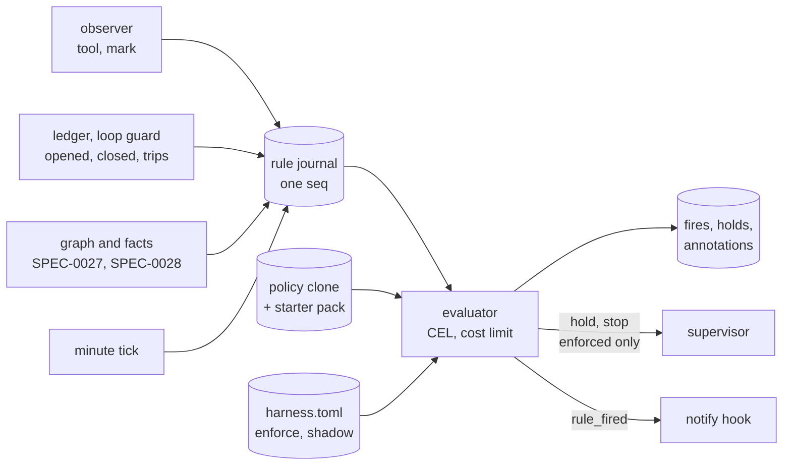
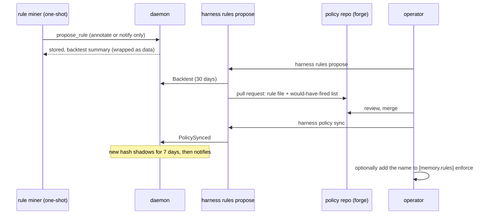

# Design: Fleet Rules

## Context

Harness already has one guard that acts on what an agent does rather than on
its process: the loop guard (`internal/loopguard`) subscribes to the observer,
counts identical tool calls in an unbroken streak, and at eight stops the
harness through the Manager's `Stop` and sends `loop_stopped`. It is fixed
code with one threshold, and it is the right shape for the one incident it was
written for. Every other recurring pattern (two harnesses editing one file, a
verify command failing the same way across runs, a one-shot that exhausts its
budget every night, a harness restarting into the same error) is today found
by the operator reading logs, if at all.

ADR-0041 decides that such patterns become rules: CEL over one event plus
fixed windowed aggregates, stored in a policy repo, proposed by a model with a
backtest, shadowed, and able to hold or stop only when the operator lists them
in hand-written config. This design explains how SPEC-0029 makes that
deterministic and keeps the authority line in the operator's config.

Related: SPEC-0027 (graph and collision events), SPEC-0028 (fact events, and
the policy repo's `weights/`), SPEC-0007 (skill repos and proposals, whose
shapes the policy repo reuses), SPEC-0020 REQ-12 (the model hold, whose shape
the rule hold reuses), SPEC-0021 REQ-4 (admission order), SPEC-0022 REQ-5 (run
outcomes), SPEC-0003 REQ "Operator Notification", SPEC-0013 (metrics),
ADR-0009, ADR-0013, ADR-0035, ADR-0037.

## Goals / Non-Goals

### Goals

* A rule's result for a given input is a pure function of that input and the
  stored history before it, so a backtest reproduces live fires exactly.
* A rule that is malformed, expensive or erroring disables itself and nothing
  else.
* No rule written by a model, and no rule merged into a policy repo, can hold
  or stop a harness until the operator names it in the global config.
* Every fire is explainable after the fact from stored rows: the event, `now`,
  each aggregate's result, and why it acted at the level it did.
* An empty policy repo still yields useful rules (the starter pack).

### Non-Goals

* **Replacing the loop guard.** It stays as it is (ADR-0041); rules see its
  trips as input.
* **General queries.** Rules cannot join, scan, or read anything but the
  journal through three primitives. Anything else needs a release.
* **Rules that start, restart, reconfigure or message an agent.** The levels
  are annotate, notify, hold and stop; no rule adds work or changes config.
* **Proving rules correct.** Lean or SMT checks of `hold` and `stop` rules in
  the policy repo's CI are deferred by ADR-0041.
* **Project-scoped rules.** Rules and the policy repo are global.

## Decisions

### CEL, not SQL, Lean or Datalog

**Choice**: `cel-go`, with the standard library and macros, a declared
`event` object per kind, `now`, and three Go primitives.

**Rationale**: `cel-go` type-checks at compile (`Env.Compile` returns issues
for an undefined field or a non-`bool` result), estimates cost statically
(`Env.EstimateCost` with a `checker.CostEstimator` for custom functions), and
enforces a runtime budget (`cel.CostLimit`, which aborts with "actual cost
limit exceeded"). Its only iteration is the comprehension macros (`all`,
`exists`, `exists_one`, `map`, `filter`), which walk a finite list and cannot
recurse; `cel.ValidateComprehensionNestingLimit` bounds their nesting. It has
no clock and no I/O unless the host registers them. It is pure Go, so releases
keep `CGO_ENABLED=0` (ADR-0037). A model can write it, and a reviewer can read
it in a pull request.

**Alternatives considered**: SQL over the store is expressive and already
there, but an arbitrary query is arbitrarily expensive and a model writing SQL
against the whole store is a large surface. Lean 4 can prove properties, but
needs its own toolchain (cgo or a second process) and asks a proposing model to
close proofs; ADR-0041 leaves it a possible later role in the policy repo's CI.
A Datalog `when`/`then` format reads well for derivations, but these rules
mostly count events over windows, which Datalog expresses poorly, and there is
no maintained pure-Go engine.

### One journal is the only input

**Choice**: every source (observer, ledger, loop guard, graph, facts, a
per-minute tick) writes rows into one `rule_journal` table with a single
`seq`. Loop-guard trips are copied from SPEC-0027's source journal, which
already captures them, rather than hooked a second time. The evaluator reads
committed rows in `seq` order; aggregates read the same table; a backtest
replays the same rows through the same code.

**Rationale**: live and replayed evaluation cannot differ if they read the same
rows in the same order. Deriving order from source timestamps would not work:
the observer polls every five seconds and delivers late, while ledger lines
commit at once. Admission order is the only order both paths can share. A row
dropped under pressure is dropped for both. The journal also keeps rule inputs
free of agent text by construction: it stores identifiers, enums, digests and
paths only, so a message or explanation cannot leak a trace.

**Alternatives considered**: evaluating the observer's in-memory fan-out, as
the loop guard does, and querying the graph and fact tables for aggregates.
That makes a backtest a reconstruction of what the evaluator probably saw,
and ties rule semantics to three other specs' schemas.

### Time is an input

**Choice**: `now` is the evaluated row's `at`, a non-decreasing admission time.
Windows, cooldowns, shadow periods and hold clearing all use it. The host
registers no clock function.

**Rationale**: a rule that reads a clock gives a different answer on replay,
and a backtest that cannot reproduce a fire cannot justify one. With `now`
bound per row, cooldown and shadow state are also functions of the journal, so
the backtest can report which fires would have been shadowed or suppressed.
Hold clearing needs time to pass without events, which the tick rows supply.

### Fixed primitives with literal selectors and windows

**Choice**: `count`, `distinct` and `exists`, each over a map literal of
equality matches on a fixed set of indexed fields and a literal window of at
most seven days; at most eight calls per rule; each charged 100 cost units at
compile and at run time; results saturate.

**Rationale**: literals let an AST validator check every key and window at
load, bound the journal lookback that retention must keep, and give each call
an index-served query of known cost. Charging the same fixed cost statically
and at run time makes the estimate an upper bound the runtime limit agrees
with. Equality-only selectors cover the starter pack and the patterns ADR-0041
names; a richer primitive is a release, which ADR-0041 accepts.

### The enforce list lives in hand-written config

**Choice**: a rule acts at `hold` or `stop` only if its name is in
`[memory.rules] enforce` in the global `harness.toml`, which nothing but the
operator's editor writes.

**Rationale**: the policy repo is written through pull requests that models
propose, and a merge is review of content. Authority to act on the supervisor
is a separate, local decision, and ADR-0041 puts it in the operator's own
configuration so that a mistaken merge, a compromised policy remote, or a
reviewer agent approving a proposal still cannot stop a harness. Keeping it
global-only (ADR-0009) keeps a cloned repository out of it. A changed rule
keeps its name in `enforce` but gets a new hash, so it shadows again before it
can act.

### Shadow by semantic content hash

**Choice**: the hash covers `on`, the normalized `when` (printed back from the
AST with `cel.AstToString`), `level`, `target` and `cooldown`; not name,
description or message.

**Rationale**: anything that changes what a rule does restarts its shadow
period; rewording a message does not. Normalizing through the AST keeps a
whitespace change from resetting the clock. A hash that already served its
shadow period is active again when reloaded, so a revert is not punished.
Starter rules skip shadow (ADR-0041): they are reviewed code in a release, and
an empty policy repo must catch collisions from the first start. An override
of one is new policy content and shadows.

### Holds reuse the model-hold shape

**Choice**: a rule hold is a persisted admission refusal with skip reason
`rule_hold`, checked beside SPEC-0020's `model_hold` in SPEC-0021 REQ-4's
order; `harness start` does not release it.

**Rationale**: operators and every listing surface already understand a held
harness. Unlike a model hold, a rule hold has its own release condition
(re-evaluation on ticks) and its own release verb, so a start that silently
cleared it would defeat a rule the operator chose to enforce.

### Proposals: the tool stores, the client proposes

**Choice**: the miner's `propose_rule` stores a validated proposal in the
daemon; `harness rules propose`, a client command holding the forge
credential, backtests and opens the pull request.

**Rationale**: the credential split of ADR-0030 and SPEC-0007: the run that
reads untrusted traces cannot touch the forge, and the process that touches the
forge never treats proposal text as instructions. The level cap at store time
means even a merged mined rule arrives at `notify` at most.

### Lint shares the loader

`harness rules lint` (REQ-21) calls the same schema check, CEL environment,
validators and cost estimator the daemon calls at load, rather than a parallel
checker. A second checker would drift, and a lint that passes a rule the daemon
then disables is worse than no lint: the policy repo's green check would vouch
for a rule that never runs. Lint needs no store because nothing it checks reads
one; backtesting stays in `harness rules backtest`, which does. Enforcement is
reported as a warning, never granted, because the enforce list lives in
hand-written config and no policy repo file can change it.

## Architecture

## Risks / Trade-offs

* **A backtest replays history, not a counterfactual.** After a would-be hold
  or stop, the recorded history continues as it happened, so later fires may
  not have occurred. → The spec states fires "on recorded history"; the hold
  span is simulated only from ticks, and reviewers read it as an estimate.
* **Silent rules backtest silent.** A rule about something that has not
  happened cannot show evidence (ADR-0041). → The pull request says so
  plainly, and shadow mode still logs its first real fires.
* **Name-based enforcement inherits across edits.** A merged change to an
  enforced rule keeps enforcement. → A new hash always shadows, the TUI feed
  shows the changed rule, and `harness rules show` marks it; hash pinning is
  an open question.
* **Journal volume.** Every tool call is a row. A fleet making 50,000 tool
  calls a day holds about 2.3 million rows at the 45-day default, with small
  rows and indexed columns. → Rows carry no text; retention is bounded; the
  queue drops rather than blocks and says so in metrics and doctor.
* **Store errors break equivalence.** A primitive that fails to read the store
  live, but not in a backtest, is the one documented exception. → Such rows
  are recorded as `store_error`, counted, and excluded from the equivalence
  claim.
* **At-most-once actions.** Fires commit before notifications and stops are
  issued, so a crash in between loses that action but never repeats it. →
  `harness rules explain` shows the fire with no action outcome.
* **Upgrade noise.** Starter rules skip shadow, so they act from the first
  start after an upgrade. → They are reviewed in the release, act at `notify`
  or below unless enforced, the collision rule only annotates (so it never
  doubles SPEC-0027's opt-in `collision` event), and `[memory.rules] disable`
  silences any of them by name.
* **Miner injection.** The miner reads other agents' traces. → Its only write
  is a stored proposal at `notify` or below, reviewed in a pull request,
  shadowed, and never enforced without the operator's own edit.

## Migration Plan

Nothing in this spec ships before ADR-0037's store, because the journal, fire
log, holds and cooldowns are tables in it. After that, in order:

1. **Engine on run events.** Journaling from the observer and the ledger,
   `loop_stopped` rows from SPEC-0027's source journal (which lands with the
   store), tick rows, the CEL environment and primitives, shadow mode,
   cooldowns, `annotate` and `notify` (`rule_fired`), `harness rules list`,
   `show`, `backtest` and `explain`, doctor, metrics, and the four `run_event`
   starter rules. Before SPEC-0027, an annotation has no graph node to show on;
   it is recorded in the fire log only.
2. **Policy repo.** `[policy_repo.*]`, `harness policy sync`, and the override
   of starter rules. Independent of step 3, and needed by SPEC-0028's weights.
3. **Graph events** (SPEC-0027): `graph_event` rows, the collision and churn
   starter rules, annotations in the graph browser. `fact_event` rows follow
   SPEC-0028; a `fact_event` rule loads before then and never fires.
4. **Hold and stop.** `[memory.rules] enforce`, the `rule_hold` skip reason
   (SPEC-0021 REQ-4) and the `rule_stop` reason (SPEC-0022 REQ-5), after steps
   1 to 3 have run in shadow long enough to trust the fire logs.
5. **Mining** (ADR-0035's gateway): `[memory] rule_miners`, `propose_rule`,
   and `harness rules propose`.

Annotate and notify can therefore ship well before hold and stop, and only
mining waits on the gateway. Existing behavior is unchanged until a rule
fires; the loop guard is untouched throughout.

## Open Questions

* **`cause_digest` is new.** It hashes the redacted last output line the
  supervisor already keeps for notify `cause`; neither the ledger nor the run
  record stores it today.
* **Enforce by hash.** Should `enforce` accept `name@hash`, so a changed rule
  loses enforcement until the operator re-pins it?
* **Miner read access.** This spec gives the miner only `propose_rule`. It
  reads through SPEC-0027's tools and `propose_rule`'s `dry_run`
  backtest; a read-only tool over the journal may prove necessary.
