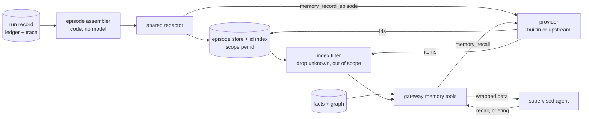
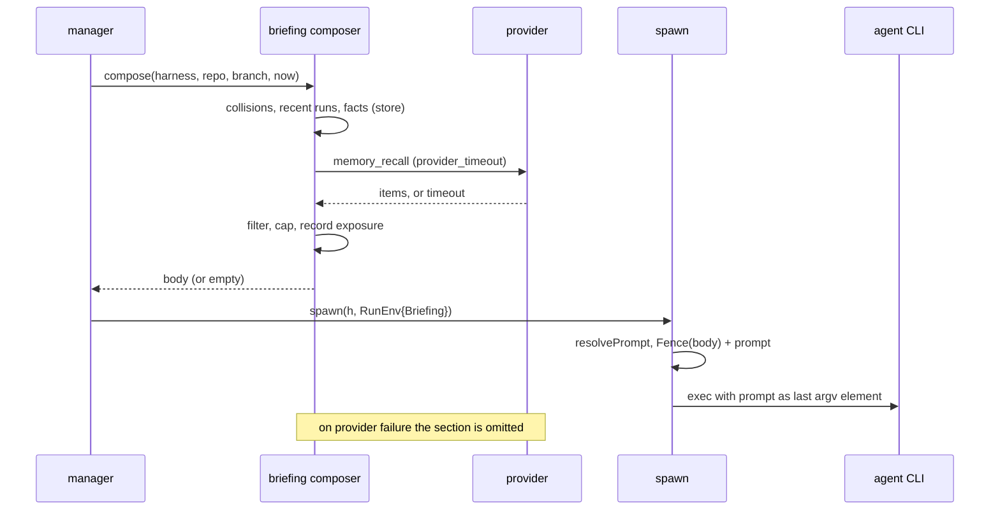

# Design: Memory Providers and Briefings

## Context

ADR-0041 gives Harness three kinds of fleet memory. The graph (SPEC-0027) and
facts (SPEC-0028) are Harness's own and are built or gated by code. The third,
**episodic memory** ("what happened the last time a run worked here"), is the
kind operators already buy or self-host: mem0, Zep and Graphiti, Letta,
basic-memory and others each store and retrieve episodes with their own
extraction, ranking and graph. ADR-0041 Decision 6 makes that store
pluggable, with a built-in default, and keeps the rules on both sides of the
contract in Harness. This spec is that contract, the episode Harness sends
through it, the `recall` tool that merges it with facts, and the briefing that
puts a capped slice of all of it in front of an agent that opts in.

Constraints this design works inside:

* The gateway (ADR-0035) already supervises upstream MCP servers once each,
  with timeouts, breakers and a call log. A provider is one more upstream.
* The daemon may make utility calls (ADR-0036): one request, no tools, output
  as data. It runs no agent loop.
* Records are redacted before persistence by one shared redactor (ADR-0033).
* A prompt one-shot's prompt is built today in `internal/supervisor/spawn.go`:
  `resolvePrompt` reads `prompt_file` into `h.Prompt`, then
  `execArgvWithRegistry` hands `h.Prompt` to the adapter's `PromptCommand`,
  which every agent adapter (`claude-code`, `crush`, `codex`) appends as the
  final argv element. `internal/tmpl.Fence` already renders SPEC-0017 REQ-10's
  nonce-delimited block. `RunEnv` already carries per-run values into spawn and
  is reused across a respawn of the same run.

Governing: ADR-0041. Depends on ADR-0033, ADR-0035, ADR-0036, ADR-0037,
ADR-0034 and ADR-0022; amends SPEC-0005, SPEC-0006 and SPEC-0017.

## Goals / Non-Goals

### Goals

* Any MCP server that implements four tools can be the episode store, and
  none is required.
* What goes into a provider is decided by code, redacted, and scoped; what
  comes out is filtered by Harness's own index and wrapped as data, whatever
  the provider does.
* A provider outage costs recall quality, never a spawn, a run or an error.
* An agent that opts in gets a small, deterministic, fenced briefing; every
  agent can pull one.
* A run that was shown a fact, by any path, cannot corroborate it.

### Non-Goals

* **Bundling or recommending a memory product.** Harness ships the built-in
  provider and a contract. It depends on no provider's SDK.
* **Moving the graph or facts behind the provider.** See the first decision.
* **Agent-written episodes.** Agents assert facts (SPEC-0028); episodes come
  only from run records.
* **Cross-installation sharing** of episodes (deferred by ADR-0041).
* **Pushing briefings into resident sessions.** Typing into a TUI agent is
  input injection; residents pull.

## Decisions

### The pluggability boundary is episodes only

**Choice**: the provider stores and ranks episodes. The graph, presence,
facts, votes, anchors, exposure records and the episode index stay in
Harness's store whatever `[memory] provider` says.

**Rationale**: rules (SPEC-0029) evaluate CEL over graph and fact events with
exact, replayable semantics, and backtests replay stored history. Operator
questions (`harness why`, `harness ask`) cite node and fact ids that must
resolve. Promotion counts distinct runs, families and repositories, and
self-corroboration needs the exposure log joined to votes. None of that can be
delegated to a store whose ranking and retention Harness does not control.
Episodes are the one kind whose value is fuzzy retrieval, which is what memory
products are good at.

**Alternatives considered**: a provider for everything (rules and promotion
would depend on third-party semantics); no provider (ADR-0041 Decision 6,
Option 1, rejected).

### Double-sided wrapping

**Choice**: Harness owns both sides of the contract. **In**: the assembler
builds the episode from the stored run record by code, runs the redactor,
fixes scope and trust class, and keeps its own copy before any provider sees
it. **Out**: every provider item is dropped unless its id is in Harness's
index under a scope the caller may see; provenance comes from the index, not
the provider; text is capped and fenced by SPEC-0027's wrapper; nothing a
provider returns can become a fact or a vote.

**Rationale**: a provider is third-party code with its own extraction model
and possibly a network service. Whatever it does internally, what reaches it is
already safe to have left, and what leaves it is only ever a quoted hint with
a Harness-attested origin.

### Scope enforced by Harness's index, not the provider

**Choice**: `memory_record_episode` returns the provider's ids; Harness indexes
each against the episode's scope. `memory_recall` receives the caller's scopes
as a hint, and Harness filters the results against its index regardless.

**Rationale**: a provider may ignore the `scope` argument, share its store
with other tools, derive new memories with new ids, or be compromised. In each
case the item either maps to an indexed id with an allowed scope, or it is
dropped. A provider can therefore return less than it should, never more, and
cannot relabel an item's origin. Returning ids from `record` (1 to 32) is what
lets derive-on-write products such as mem0 participate: each derived memory is
indexed under its source episode's scope.

**Alternatives considered**: trusting provider metadata for scope (widening is
then one bug away); re-serving Harness's own episode body instead of provider
text (safe but discards the provider's extraction, the reason to plug one in).

### The provider upstream is reserved

**Choice**: the provider's tools are hidden from every policy and refused to
`call_tool`, and the upstream must be global and shared.

**Rationale**: an agent calling `memory_recall` directly would bypass the
scope filter and the wrapper, and `memory_forget` would let it erase history.
A project-declared upstream would let a cloned repository choose where every
harness's episodes go.

### Harness keeps the episode and the built-in provider indexes it

**Choice**: every assembled episode is stored by Harness. The built-in
provider is an FTS5 and `vec1` index over those rows, served over an
in-process MCP transport.

**Rationale**: the stored copy is the audit trail of what left the daemon
(`harness memory episodes <id>`), the source for retrying a failed record, and
the input to a future backfill when the operator switches providers. Serving
the built-in provider through the same contract means REQ-4's suite and
REQ-9's filter test the path every provider takes; there is no fast path that
skips enforcement.

### Briefings: pull for everyone, push by opt-in, inside the fence

**Choice**: `briefing` and `harness://memory/briefing` are available to every
attributed harness. `memory_briefing = true` additionally prepends the
briefing to a prompt one-shot's prompt as a SPEC-0017 fenced block, and is
global-only.

**Rationale**: ADR-0041's "context is scarce" driver: nothing is pushed unless
the operator asks. The fence is the existing, tested way to put text Harness
did not author into a prompt: a CSPRNG nonce the content cannot contain, with
control characters stripped. Briefing text includes agent-asserted facts and
provider output, so the key that enables it follows the rule for risky
capabilities: off by default, global-only, counted and visible in
`harness doctor`. It is deliberately a separate key from `untrusted_inline`,
so enabling memory does not also open the event fence.

**Feasibility against the code**: the manager computes the briefing before
calling spawn and passes it on `RunEnv` (which already survives a respawn of
the same run). In `spawn`, after `resolvePrompt` and before `execArgv`, a new
step replaces `h.Prompt` on the per-spawn copy with `Fence("harness-memory",
"briefing", body, true) + "\n\n" + h.Prompt`. The copy is never written back,
as `resolvePrompt` already guarantees for `prompt_file`. Because all three
adapters pass the prompt as one argv element, the only new failure is the
per-argument limit (128 KiB on Linux); REQ-16 skips the briefing rather than
failing the run. The 4096-byte document cap equals `tmpl.MaxUntrustedBytes`,
so the fence never truncates a briefing. When SPEC-0017 REQ-12's `stdin` and
`file` deliveries land for `command` harnesses, the composed prompt goes
through them unchanged.

### Deterministic sections, bounded shares

**Choice**: fixed section order, fixed item caps, fixed character shares,
whole-item dropping, and deterministic tie-breaks for every section except the
provider's.

**Rationale**: a briefing that differs between two identical spawns breaks the
agent's prompt cache and makes a regression impossible to diff. Shares stop
one busy section (twenty facts) from starving the collision warning, which is
the section most likely to change what an agent does next.

### Exposure is recorded for every delivery path

**Choice**: prompt, tool and resource deliveries, and `recall`, write
SPEC-0028's `fact_exposures` rows for the facts they serve. Previews do not.
SPEC-0028 owns the table and the withhold-on-failure rule; this spec says only
when its surfaces write.

**Rationale**: "a run that was shown this fact cannot vote on it" needs to know
what each run was shown. A prepended briefing makes no call, and the ADR-0035
call log stores no response bodies, so served ids need their own record.
Episodes are not recorded: nothing votes on them.

## Architecture

Episodes in and hints out:

A prompt one-shot with `memory_briefing = true`:

## Risks / Trade-offs

* **Poisoned memory reaches prompts.** A fact or provider item can carry
  injected text. → Push is opt-in and global-only, everything is fenced and
  wrapped as data, text is capped, untrusted flags travel with items, and
  memory cannot select a command or widen a permission (ADR-0008).
* **Provider quality varies.** Recall results depend on the operator's choice.
  → The conformance suite checks behavior, not quality; sections are never
  interleaved, so a weak provider cannot push facts out of a response.
* **Episodes leave the host with a network provider.** → Only redacted,
  code-assembled fields leave; `harness doctor` names the host; the built-in
  default keeps everything local.
* **Storage.** Harness keeps every episode even with an external provider. At
  a few KiB per run this is small next to trace tables, and `retention` bounds
  it.
* **Latency at spawn.** A briefing can add up to `provider_timeout` to a
  one-shot's start. → Default 2 s, only for opted-in harnesses; the store
  sections are local reads.
* **Late pull requests.** A pull request opened after run end, or before the
  next `harness graph sync`, is missing from the episode, and the contract has
  no update. Recent-run sections, which read the graph live, do show it.

## Migration Plan

Neither ADR-0037's store nor ADR-0035's gateway exists yet, and ADR-0034's
`harness.v1` services are not generated. Sequencing:

1. **Now, no dependencies.** The episode assembler as a pure function over a
   closed run record (today's ledger records and `internal/runtrace` events),
   with the redactor, the `text` rendering and golden tests. The briefing
   composer as a pure function over interfaces, with determinism tests. The
   prompt composition step in `spawn` behind `RunEnv.Briefing`, using
   `tmpl.Fence`, with an empty briefing as the only producer: no behavior
   change until something fills it.
2. **Before the store and gateway.** `memory_briefing` with only the
   `recent_runs` section (from the existing ledger query) and, once SPEC-0027
   ships presence in memory, `collisions`. This delivers the push path and the
   config keys with no provider and no tool.
3. **With ADR-0037.** The episode table, index, FTS5 and `vec1` tables,
   retention pruning, and the built-in provider; `MemoryService` and the
   `harness memory` commands once ADR-0034's services exist.
4. **With ADR-0035.** The `recall` and `briefing` tools, the resource, the
   reserved-upstream rule, upstream providers, `provider check`, exposure
   records for tool calls, and degraded behavior.
5. **With SPEC-0028.** The `facts` sections of `recall` and briefings, and
   exposure feeding no-self-corroboration.

Every step is additive: a configuration without `memory_briefing` or
`[memory]` behaves as today.

## Open Questions

* **Fence ownership.** SPEC-0017 REQ-10 says no key but `untrusted_inline`
  opens the fence. This spec amends that (REQ-20) with a second, separately
  named door. The SPEC-0017 owners should confirm, or the briefing should get a
  distinct delimiter.
* **Project harnesses.** Because `memory_briefing` is global-only, a harness
  defined only in a project file can pull a briefing but never have one
  pushed. Is a global override for project harnesses needed?
* **Multi-repository runs.** A run whose sessions span repositories is scoped
  to its primary session's repository; edits elsewhere are left out.
* **Episode updates.** The contract has no update, so a pull request linked
  after run end never reaches the episode. A `memory_record_episode` re-send
  with the same `episode_id` could serve, if providers treat it as an upsert.
* **Provider switch.** Episodes recorded under a previous provider are not
  served after a switch. A `harness memory provider backfill` from Harness's
  stored copies is possible but not specified.
* **Vector extension naming.** ADR-0036 says "sqlite-vec where ADR-0037's
  driver loads it"; ADR-0037 chose ncruces `vec1`. This spec follows ADR-0037.
