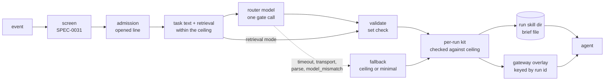
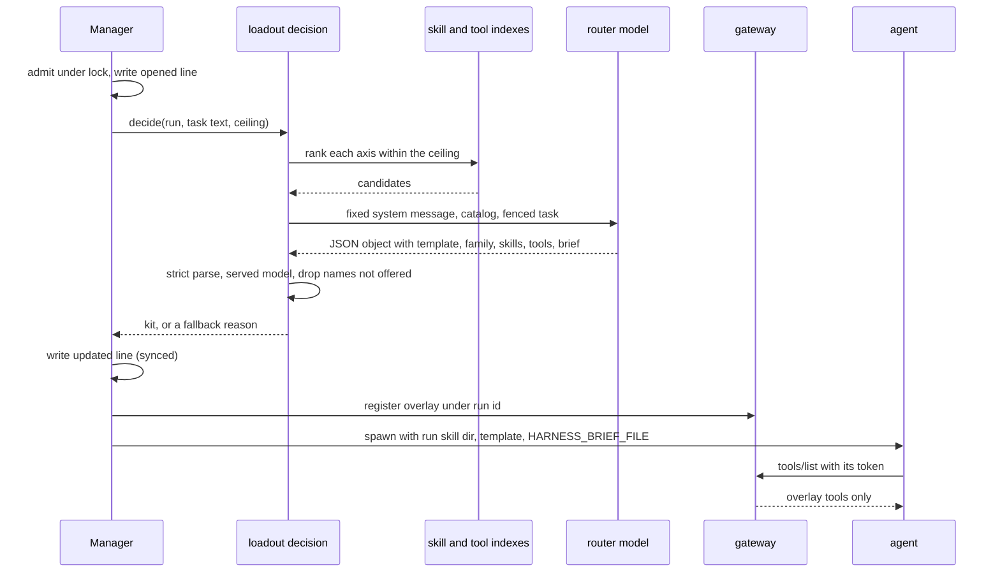

# Design: Task Loadouts

## Context

A harness's reach is fixed today for every task it will ever run: every skill
SPEC-0006 projects, its whole MCP policy under ADR-0035, and its allowed tools.
For a frontier model that is only wasteful. For the Crush workers on a
LiteLLM-served Qwen 27B that drain Switchboard queues, it decides whether a run
works at all. Every skill description and tool schema costs context on every
turn, tool-choice accuracy falls as the list grows, and a small model rarely
thinks to call `search_skills` or `search_tools`. A fixed reach is also the
opposite of least privilege: a run that labels an issue holds the same write
tools as a run that fixes one, and ADR-0042's `warn` verdict still runs with
all of them.

ADR-0043 decides that a harness may name a loadout. For each event-carrying
one-shot, retrieval cuts each axis of the harness's ceiling to a short list, a
router model picks from that list in one gate call, validation keeps only what
was offered, and the run spawns with only those skills, only those tools, an
operator template, and a brief delivered as untrusted data. This design
explains how SPEC-0032 keeps every choice a subset of the ceiling, and how it
degrades when a piece is missing.

Most of what it stands on is unbuilt. SPEC-0007's FTS5 index over skill repos
exists (`internal/skillserve`), and so does SPEC-0017's template package
(`internal/tmpl`). The model API and hybrid skill index (ADR-0036), the MCP
gateway and its tool index (ADR-0035), central adapter declarations
(ADR-0039), SPEC-0006's `skill_paths` projection, SPEC-0031's gate calls and
levels (drafted alongside this spec), and the dispatcher (#541) do not.

Related: ADR-0042 and SPEC-0031 (gate calls, verdicts, levels), ADR-0035
(gateway, policy, tiers, call log), ADR-0036 (model API, skill index, evals),
ADR-0039 (adapters and families), ADR-0021 and SPEC-0014 (event runs and the
event file), SPEC-0017 (templates and the untrusted fence), SPEC-0021 REQ-4
(admission), SPEC-0022 (run records), SPEC-0026 (package manifests),
SPEC-0013 (metrics), ADR-0026 (served-model attestation).

## Goals / Non-Goals

### Goals

* Narrow only, provable per axis by a set check: validation keeps only
  candidates, candidates are drawn only from the ceiling, and the kit is checked
  against the ceiling again before spawn.
* Never worse than today on failure. `fallback = "ceiling"` reproduces
  today's spawn exactly.
* A `retrieval` mode that needs no chat model.
* Honest per adapter. An axis a client cannot narrow is recorded as not
  narrowed, never implied.
* Untrusted text stays data. The brief travels exactly as the payload it came
  from, and never enters the ledger.
* Countable. Invalid names, fallbacks, misses and eval arms show whether a
  loadout helps a given model.

### Non-Goals

* **Mid-session narrowing** for resident harnesses, through
  `notifications/tools/list_changed` and re-projected skills. Deferred by
  ADR-0043.
* **Router-chosen built-in tools.** Only the `narrow` level touches them.
* **Per-task `max_turns`, budget or model.** Lanes cover model size.
* **Screening the brief** as its own entry point.
* **Templates shipped by packages.**
* **The dispatcher.** This spec fixes what a lane choice may do; #541's
  ADR-0021 amendment says how a queue names a loadout.
* **Projecting skill-repo skills.** They stay served by search.

## Decisions

### The decision sits between admission and spawn

**Choice**: a decision starts after the run is admitted and its `opened` line
is written, outside the admission lock, and finishes before the kit is built.

**Rationale**: admission first means a run that operating hours, a hold or a
budget refuses never spends a router call, and budgets stay the authority on
whether a run happens. Outside the lock means a slow router never serializes
admission: SPEC-0021 REQ-4 holds the lock only for the decision and the ledger
append. After admission the run has an id, so the brief file can be named
beside its event file.

**Alternatives considered**: deciding at `Fire`, as screening does, would make
one call per event. But each receiving harness has its own ceiling, so one
decision cannot serve a fan-out, and calls would be spent on runs admission
then refuses. Deciding inside the spawn path would put a network call under
the supervisor's per-harness state.

### One deadline for the whole decision

**Choice**: `timeout` bounds task text, retrieval (including indexing a new
ceiling skill and the query embedding), the router call and validation.

**Rationale**: the operator reasons about one number, the longest a run can
wait before it spawns. It also bounds `retrieval` mode, whose embeddings
request can hang. Separate retrieval and router deadlines add a knob without
changing the worst case.

### Restrict to the ceiling before taking the top candidates

**Choice**: ranking considers only ceiling items, and the top `candidates` are
taken after that restriction.

**Rationale**: cutting a global top-k and then intersecting with the ceiling
can leave zero candidates when other harnesses' skills dominate the index. It
would also make one harness's candidates depend on another's ceiling.
Restricting first makes "retrieval never widens" a property of the query, not
of a later filter.

### Validation is a set check, and a bad name is counted, not fatal

**Choice**: a name that was not offered is dropped and counted `invalid`, and
the rest of the reply stands.

**Rationale**: a small router often returns a near-miss name. Failing the whole
decision for one would push most runs to fallback. Dropping is safe because
every kept name is a candidate, and the count exposes a router that invents.
Fuzzy matching was rejected: it would let a reply select an item it did not
name.

### Strict parse, and a schema where the endpoint accepts one

**Choice**: the reply content must be exactly one JSON object matching the
schema. The request asks for that schema as a `json_schema` response format.
An endpoint that rejects the response format may be asked once more without
it, inside the same deadline.

**Rationale**: the parser is the security boundary, and the schema is a
quality aid. Many OpenAI-compatible servers can constrain output to a schema,
but a proxy may strip or reject the field, so support cannot be assumed. The
implementation should remember a rejection per `base_url` and `model` for the
daemon's life, so only the first call pays for the retry. Extracting an object
from prose was rejected: a parser that searches is one an injected reply can
steer.

### The task is fenced; the catalog is not

**Choice**: candidate names and descriptions form a plain catalog. Each field
of the task text sits in its own SPEC-0017 fence with a fresh nonce. The
system message is fixed text in the binary.

**Rationale**: the router must read the catalog as its menu, and the fence
marks exactly where untrusted text starts. The fence does not neutralize
injection (SPEC-0017 says so of itself). What makes a steered router harmless
is the narrow-only rule: its worst outcomes are a failed run or the ceiling.

Catalog text is not all the operator's. Template descriptions are. Skill
descriptions are the operator's or a package author's, and SPEC-0026 REQ-5
scans the latter. Tool descriptions come from upstream MCP server authors, a
third party (see Risks).

### The task text is a subset of the screened text

**Choice**: the router reads a forge event's title, body, comment and ref, or
the whole screened text for any other source, and nothing screening did not
see.

**Rationale**: screening and routing want different things from one payload.
Screening must cover every string the sender wrote, including review bodies,
commit messages and branch names. Routing needs what the task is about, and a
push event's fifty commit messages would crowd a small router's window without
telling it which template applies. Drawing from the screened text keeps one
invariant: no text reaches the router that screening did not see.

### One managed skill directory per harness, reconciled before every spawn

**Choice**: a harness that selects skills owns one directory,
`<jobs dir>/<harness>/loadout-skills/`. It is bootstrapped on the harness's
first qualifying spawn, then reconciled before every spawn to exactly that
run's set: chosen skills, none, or the full merged set. Reconciling copies what
differs, removes what is not in the set, and writes a manifest. The adapter's
`skills.redirect` points every process of that harness at the directory, in
place of its `target`, by a flag, an environment variable, or a config file the
daemon bootstraps beside it. The directory is collected when the harness stops
qualifying, and swept at daemon start.

**Rationale**: a directory per run is a directory per failure. A run killed
mid-spawn, a crash before its record closes, or a pruning bug each leave a copy
of a skill tree behind, and they pile up exactly where nobody looks. One
directory per harness bounds skill state at one directory per qualifying
harness, however many runs fail. Reconciliation is idempotent, so the next
spawn repairs whatever a failed run left, including skills an agent edited.
Nothing waits for a garbage collector. It is safe because SPEC-0014 never runs
two processes of one harness at once. When #541 lifts that, the rule becomes
one directory per concurrency slot: still a fixed pool, never per run. A stable
path also means a family whose redirect is a config-file key needs that file
written once at bootstrap, not per run. "In place of `target`" matters because
ADR-0039's built-in `claude-code` table uses `~/.claude/skills` as both a
default root and the target. That directory is shared by every `claude-code`
harness and by the operator, so a directory added beside it would narrow
nothing.

**Alternatives considered**:
* A per-run directory under the jobs directory, pruned with the run, was the
  first draft. It isolates concurrent runs that cannot happen today, and it
  leaks on every failure path that skips pruning.
* A per-run home or config directory is one way a family might implement the
  redirect (see Open Questions), but it carries credentials and settings and
  cannot be the general rule.

### The overlay is keyed by run through the spawn token

**Choice**: when the daemon mints a spawn's `HARNESS_MCP_TOKEN`, it binds the
token to the run id. The overlay is registered under that run id before spawn.

**Rationale**: the token is already per spawn, and an `env_file` cannot forge
it (SPEC-0005 REQ "Caller Identity"). A one-shot's spawn is its run. The call
log already records `run_id` from the token's owner (ADR-0035 "The call log").
Keying the overlay by harness would break as soon as two runs of one harness
overlap, and `HARNESS_RUN_ID` is writable by the agent.

### Full exposure over the overlay

**Choice**: overlay tools are listed directly with their schemas, and
`search_tools` and `call_tool` are not listed.

**Rationale**: an overlay holds at most 16 tools, which is ADR-0035's own case
for `full`. A small model rarely searches, and `lazy` over eight tools spends
two meta-tools and a round trip to find what could simply be listed. The
overlay is fixed before spawn, so the listing never churns the prompt cache.

### Left-out skills stay reachable by search

**Choice**: for a run whose skills axis is narrowed, `search_skills` and
`get_skill` also serve its ceiling as `projected/<name>`.

**Rationale**: ADR-0043's driver is that skills are relevance, so a missed skill
must be recoverable, and search is the only recovery channel an agent has.
Serving through the gateway also makes every recovery a call-log row, which is
how a skill miss is counted. SPEC-0007 serves only skill repos today, so this
is an amendment rather than a reuse.

### Misses come from the call log

**Choice**: a skill miss and a tool miss are call-log rows tagged
`loadout_miss`. There is no separate table.

**Rationale**: both already pass through the gateway as one row each, and each
row carries harness and run id, so misses join to run records and share the
call log's retention. A second table would duplicate the record.

### `narrow` reduces the ceiling before retrieval

**Choice**: under `narrow`, write-tier tools leave the tool ceiling before
retrieval, not after validation.

**Rationale**: filtering after validation would let write tools take slots and
then vanish, leaving a smaller kit. Filtering first gives the router up to
`max_tools` read tools. The verdict is known at `Fire`, before admission, so
nothing waits for it. ADR-0043's diagram draws `narrow` after validation. The
property it asserts, no write tool in the overlay, holds either way.

### A list present means an axis narrowed

**Choice**: the record carries `skills` and `tools` exactly when that axis was
narrowed, and an empty list means narrowed to nothing. Two reasons join the
ones ADR-0043 names: `unsupported` and `index`.

**Rationale**: a reader tells a run that received no skills (`skills = []`)
from one that received the ceiling (no `skills`) without a second field.
`unsupported` records the honest per-adapter case ADR-0043 requires. `index`
covers a store failure during retrieval, which none of the router's reasons
describe.

### A loadout needs `triggers`

**Choice**: `loadout` on a harness without `triggers` fails the load.

**Rationale**: such a harness can never carry an event, because
`harness trigger --event` refuses an envelope for an unbound source. Every run
would record `no_event`. Other specs reject a key that can never act in the
same way (SPEC-0017 REQ-3's unused `model`).

### Lanes are explained, not run, until the dispatcher lands

**Choice**: the spec fixes the lane call, its validation and the first-lane
default, and exercises them through `harness loadout explain --lanes`.

**Rationale**: ADR-0043 fixes only what a lane choice may do. How a queue names
a lanes loadout is the dispatcher's own amendment. Explain makes the safety
property, never a harness outside `lanes`, testable today.

## Architecture

A routed run, from the event to the agent:

The decision and the spawn, in order:

Where the pieces would live:

| Package | Change |
|---|---|
| `internal/config` | `[loadout.*]`, templates, the `loadout` key, validation against each harness, rejection on every front door |
| a new `internal/loadout` | task text assembly, retrieval over the ceiling, the router and lane calls, validation, fallback |
| `internal/supervisor` | the call site after admission, the managed skill directory (bootstrap, reconcile, sweep), the brief file, the kit check, pruning |
| `internal/tmpl` | the `loadout.*` context paths and the `loadout.brief` fence |
| `internal/adapter` | the `skills.redirect` and `tools.read_only` declarations (ADR-0039) |
| the gateway (ADR-0035) | token-to-run binding, overlays, `loadout_miss` |
| `internal/ledger`, `internal/metrics` | the `loadout` object and the `harness_loadout_*` series |
| `cmd/harness` | `loadout explain`, `loadout misses`, describe and doctor rows |

## Risks / Trade-offs

* **Every routed run waits for a model.** Seconds for a 30B router, on top of
  screening. → `timeout` bounds it, `retrieval` mode removes the chat call,
  and the wait happens outside the admission lock.
* **A router miss looks like an agent failure.** A too-tight `max_tools` turns
  into failed runs. → `loadout_miss` rows, `harness loadout misses`, and eval
  arms that compare against the ceiling before a loadout is turned on.
* **The brief is a new channel into the agent.** → It is capped, fenced when
  inline, off the ledger, opt-in to inline, carries the event's verdict, and
  is no more trusted than the payload. Under `brief = "inline"`, an adapter
  that delivers its prompt by argv puts the fenced brief in argv, as SPEC-0017
  already does for fenced event text. `file` is the default for that reason.
* **Tool descriptions are third-party text in the router's catalog.** A
  poisoned upstream description can steer the router. → The narrow-only rule
  bounds the damage to choosing among candidates. `harness loadout explain`
  shows exactly what the router saw.
* **Additive MCP wiring leaves an agent's own servers outside the overlay.** →
  `harness doctor` warns for a loadout harness without `mcp_exclusive = true`,
  and the record's `tools` names only gateway tools.
* **Built-in tools are the widest exfiltration path, and narrowing them is
  client-specific.** An allowlist that a permission bypass such as
  `auto_accept` overrides narrows nothing. → REQ-14 requires the enforced
  property, tested against the real client, and records
  `builtin_tools = "unnarrowed"` wherever a family declares no set.
* **Skill narrowing depends on each client.** Until a family's
  `skills.redirect` is settled, its harnesses get tool and template narrowing
  only. → The record says `unsupported`, and doctor warns.
* **A managed directory can drift.** An agent or an operator may edit it
  between runs. → The next spawn reconciles it against the winning copies, and
  doctor warns when contents and manifest disagree.
* **Templates multiply what the operator maintains.** → Each is an ordinary
  SPEC-0017 template, parsed at load against every harness that can render it.
* **A loadout needs the embedding endpoint for skills.** → A decision degrades
  to FTS5, records `degraded`, and still applies.

## Migration Plan

Nothing here ships before SPEC-0031's gate calls, and everything is opt-in:
without a `[loadout.*]` table or a `narrow` level, no run changes. In order:

1. **Config and explain for templates.** `[loadout.*]`, the `loadout` key, all
   load-time validation, and `harness loadout explain` for the template and
   brief axes. Needs `[model_api]` and gate calls.
2. **The gateway overlay and `narrow`.** Token-to-run binding, overlays,
   `full` exposure, `loadout_miss`, and the `narrow` level with MCP tools.
   `narrow` is useful without any loadout, so it can ship first. Needs
   ADR-0035's gateway.
3. **Tool retrieval and routed runs.** The tools axis in both modes, the
   decision on the spawn path, the brief file, recording and metrics. Needs
   ADR-0035's tool index.
4. **Skills.** The skill-index entries for ceiling skills, `projected/`
   search, the managed directory with its bootstrap, reconcile and sweep, and
   each family's `skills.redirect` as it is settled and tested.
   Needs ADR-0036's hybrid index and SPEC-0006's `skill_paths`.
5. **Built-in narrowing.** Each family's `tools.read_only`, tested against the
   real client.
6. **Eval arms**, once ADR-0036's eval runner exists.
7. **Lanes on a runtime path**, with #541's ADR-0021 amendment.

Rollback: removing `loadout` from a harness, or `narrow` from its levels,
restores today's spawn. Old records keep their `loadout` objects, which a
reader ignores if it does not know them (SPEC-0022 REQ-2).

## Open Questions

* **How each family is pointed at its managed skill directory.** `claude-code`
  reads skills from a user directory and a project directory, and ADR-0039's
  built-in table uses the user directory as its target. Relocating the whole
  configuration directory carries credentials and settings. `crush` and
  `codex` each need their own mechanism. Because the path is stable per
  harness, a mechanism that is a config-file key can be written once at
  bootstrap. Each declaration needs a test that drives the real client and
  observes which skills it loads.
* **Skill-repo skills on the skills axis.** SPEC-0006 excludes skill repos from
  projection, and SPEC-0007 serves them only by search, so this spec keeps them
  off the axis, as ADR-0043 does. A small model that rarely searches would
  benefit from a chosen skill-repo skill copied into the per-run directory.
  Should that be allowed, reversing SPEC-0006's exclusion for that run?
* **The brief as its own screening entry point.** The brief carries the
  event's verdict and is not screened again (ADR-0043). A router could still
  distill an injection into a shorter and clearer one. Screening it would add
  a fourth entry point and a second wait.
* **Who owns the router's instructions.** The system message is fixed in the
  binary. Operators may want to add routing guidance ("prefer `triage` for
  questions") without templates doing that work. An operator-extensible
  section would be operator text, but it changes the router's behavior in ways
  the eval arms must then cover.
* **Mid-session MCP narrowing for resident harnesses.** The overlay mechanics
  could serve a resident harness per prompt through `list_changed`, at the
  cost of the prompt-cache churn ADR-0035 avoids.
* **Whether `narrow` should become the default `on_warn`.** This spec keeps
  SPEC-0031's `notify` and recommends `narrow` for public sources. `narrow` as
  the default would need doctor to be clean across the fleet first, since a
  family with no read-only set would silently narrow less.
* **A trial's ceiling in eval arms.** ADR-0036 routes trial MCP traffic through
  the gateway with `mcp_exclusive = true` but names no policy for a trial. The
  eval arms need one to define the tool ceiling both arms share.
* **Whether explain should screen.** It does not, as `harness trigger --event`
  does not. An operator explaining a delivery that was held may want to see
  the verdict beside the kit.
